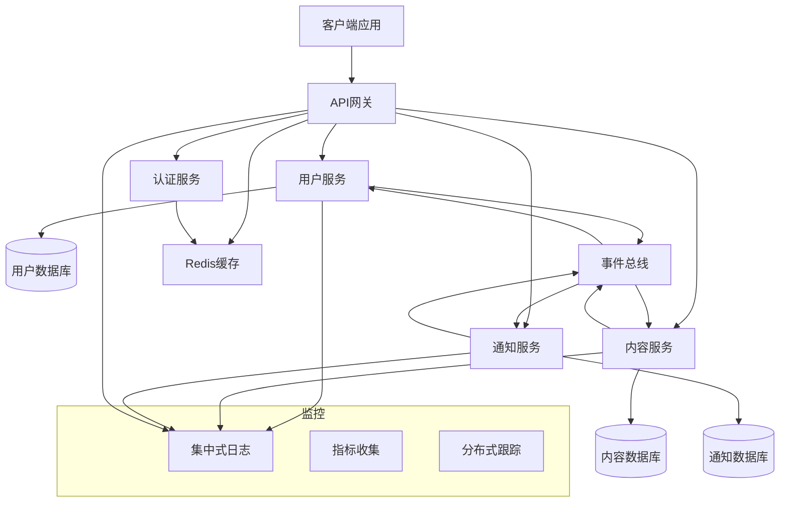
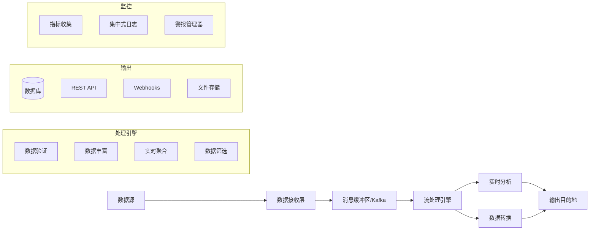

# 复杂系统规范示例

<!-- 导航元数据 -->
<!-- 示例：复杂系统 | 级别：高级示例 | 先决条件：simple-feature-spec.md -->
<!-- 相关：ai-reasoning/decision-frameworks.md, process/design-phase.md, templates/design-template.md -->

**📍 您的位置：** [主指南](../../README.md) → [示例](README.md) → **复杂系统规范**

## 快速导航
- **🎯 从简单开始：** [简单功能规范](simple-feature-spec.md) - 首先学习基础示例
- **🧠 决策帮助：** [AI决策框架](../ai-reasoning/decision-frameworks.md) - 处理复杂选择
- **📋 设计流程：** [设计阶段指南](../process/design-phase.md) - 系统化处理复杂性
- **📝 设计模板：** [设计模板](../templates/design-template.md) - 用于复杂设计的结构

---

本节演示如何将规范驱动方法应用于更大、更复杂的系统。这些示例展示了如何处理复杂性，将大型功能分解为可管理的组件，并协调多个相互关联的部分。

## 示例1：多服务API架构

### 概述
一个全面的API系统，通过多个微服务处理用户管理、内容交付和实时通知。此示例演示了如何为一个具有多个组件和复杂交互的分布式系统编写规范。

### 完整的规范文档

#### 需求文档

```markdown
# 多服务API架构 - 需求

## 引言
此功能实现了一个可扩展的API架构，由处理用户管理、内容操作和实时通知的多个微服务组成。系统必须支持高可用性、水平扩展和跨服务的一致数据管理。

## 需求

### 需求 1
**用户故事：** 作为一名系统架构师，我想要一个分布式的API架构，以便系统可以独立扩展并保持高可用性。

#### 验收标准
1. WHEN 系统接收到请求 THEN 它 SHALL 将它们路由到适当的微服务
2. WHEN 一个服务失败 THEN 系统 SHALL 继续以降级功能运行
3. WHEN 负载增加 THEN 单个服务 SHALL 独立扩展
4. IF 服务需要通信 THEN 它们 SHALL 使用定义良好的API和消息传递

### 需求 2
**用户故事：** 作为一名开发人员，我希望跨服务的数据管理保持一致，以便在分布式系统中维护数据完整性。

#### 验收标准
1. WHEN 一个服务中的数据被修改 THEN 相关服务 SHALL 被通知变更
2. WHEN 事务跨越多个服务 THEN 系统 SHALL 确保数据一致性
3. WHEN 服务暂时不可用 THEN 数据操作 SHALL 被排队并重试
4. IF 数据冲突发生 THEN 系统 SHALL 有解决策略

### 需求 3
**用户故事：** 作为一个API消费者，我希望统一访问所有服务，以便我可以通过单一接口与系统交互。

#### 验收标准
1. WHEN 发出API请求 THEN 客户端 SHALL 使用单一入口点
2. WHEN 服务内部发生变化 THEN 外部API SHALL 保持稳定
3. WHEN 需要认证 THEN 它 SHALL 在所有服务中一致地工作
4. IF 需要速率限制 THEN 它 SHALL 在整个API中统一应用

### 需求 4
**用户故事：** 作为一名系统管理员，我需要全面的监控和可观察性，以便我能维护系统健康和性能。

#### 验收标准
1. WHEN 服务正在运行 THEN 系统 SHALL 提供健康检查和指标
2. WHEN 发生错误 THEN 它们 SHALL 被记录并跨服务边界进行跟踪
3. WHEN 性能下降 THEN 警报 SHALL 被触发并提供可操作的信息
4. IF 需要调试 THEN 分布式跟踪 SHALL 可用于请求流
```

#### 设计文档

```markdown
# 多服务API架构 - 设计

## 概述
该系统将使用微服务架构实现，带有用于统一访问的API网关，服务之间采用事件驱动通信，并为认证、日志和监控等横切关注点提供共享基础设施。

## 架构

### 高层架构


## 组件和接口

### API网关
- **目的**：单一入口点、路由、认证、速率限制
- **技术**：Kong/Nginx 及自定义插件
- **职责**：请求路由、SSL终止、CORS、速率限制

### 核心服务

#### 用户服务
```typescript
interface UserService {
  // 用户管理
  createUser(userData: CreateUserRequest): Promise<User>;
  getUserById(id: string): Promise<User>;
  updateUser(id: string, updates: UpdateUserRequest): Promise<User>;
  deleteUser(id: string): Promise<void>;
  
  // 认证集成
  validateUserCredentials(email: string, password: string): Promise<AuthResult>;
  updateUserProfile(id: string, profile: ProfileData): Promise<User>;
}
```

#### 内容服务
```typescript
interface ContentService {
  // 内容操作
  createContent(authorId: string, content: CreateContentRequest): Promise<Content>;
  getContent(id: string): Promise<Content>;
  updateContent(id: string, updates: UpdateContentRequest): Promise<Content>;
  deleteContent(id: string): Promise<void>;
  
  // 内容发现
  searchContent(query: SearchQuery): Promise<ContentSearchResult>;
  getContentByAuthor(authorId: string): Promise<Content[]>;
  getFeedForUser(userId: string): Promise<Content[]>;
}
```

#### 通知服务
```typescript
interface NotificationService {
  // 通知管理
  createNotification(notification: CreateNotificationRequest): Promise<Notification>;
  getNotificationsForUser(userId: string): Promise<Notification[]>;
  markNotificationAsRead(id: string): Promise<void>;
  
  // 实时交付
  subscribeToNotifications(userId: string): Promise<WebSocketConnection>;
  sendRealTimeNotification(userId: string, notification: Notification): Promise<void>;
}
```

### 事件驱动通信
```typescript
interface EventBus {
  publish(event: DomainEvent): Promise<void>;
  subscribe(eventType: string, handler: EventHandler): Promise<void>;
  unsubscribe(eventType: string, handler: EventHandler): Promise<void>;
}

interface DomainEvent {
  id: string;
  type: string;
  aggregateId: string;
  payload: any;
  timestamp: Date;
  version: number;
}
```

## 数据模型

### 服务数据隔离
- 每个服务拥有其数据和数据库
- 服务之间无直接数据库访问
- 通过事件进行数据同步
- 最终一致性模型

### 共享数据模式
- **用户身份**：跨服务共享用户ID
- **内容引用**：通知中使用的内容ID
- **事件溯源**：用于审计和重放的领域事件

## 错误处理

### 断路器模式
- 防止服务间的级联失败
- 自动恢复和健康检查
- 可配置的失败阈值

### 重试和超时策略
- 对暂时性故障采用指数退避
- 服务特定的超时配置
- 用于失败事件的死信队列

### 优雅降级
- 当非关键服务失败时，核心功能继续运行
- 当服务不可用时提供缓存响应
- 对服务中断提供用户友好的错误消息

## 测试策略

### 服务级测试
- 每个服务内业务逻辑的单元测试
- 数据库和外部依赖的集成测试
- 服务间的契约测试

### 系统级测试
- 完整用户工作流的端到端测试
- 用于可扩展性验证的负载测试
- 用于弹性测试的混沌工程

### 监控和可观察性
- 每个服务端点的健康检查
- 请求流的分布式跟踪
- 业务指标和警报
```

#### 任务文档

```markdown
# 多服务API架构 - 实施计划

- [ ] 1. 设置开发基础设施和工具
  - 为本地开发创建Docker Compose设置
  - 设置带有服务特定构建的CI/CD流水线
  - 配置共享开发工具（linting、测试、文档）
  - 为部署创建基础设施即代码模板
  - _需求: 1.1, 4.1_

- [ ] 2. 实现共享库和实用工具
- [ ] 2.1 创建通用数据模型和接口
  - 为跨服务通信定义共享的TypeScript接口
  - 实现通用的错误类型和响应格式
  - 为API契约创建验证模式
  - 为共享实用工具编写单元测试
  - _需求: 2.1, 3.2_

- [ ] 2.2 构建事件总线基础设施
  - 实现事件发布和订阅接口
  - 创建事件序列化和反序列化实用工具
  - 添加事件版本控制和向后兼容性支持
  - 为事件总线功能编写集成测试
  - _需求: 2.1, 2.2_

- [ ] 2.3 创建认证和授权库
  - 实现JWT令牌验证中间件
  - 创建基于角色的访问控制实用工具
  - 添加服务到服务的认证机制
  - 为认证流程编写安全测试
  - _需求: 3.3_

- [ ] 3. 构建用户服务
- [ ] 3.1 实现用户数据模型和存储库
  - 创建带有验证和业务规则的用户实体
  - 实现数据库模式和迁移
  - 构建用于用户数据访问的存储库模式
  - 为用户模型和存储库编写单元测试
  - _需求: 1.1, 2.1_

- [ ] 3.2 创建用户管理API端点
  - 实现用户管理的CRUD操作
  - 添加用户个人资料管理功能
  - 创建用户搜索和筛选功能
  - 为用户API端点编写集成测试
  - _需求: 1.1, 3.1_

- [ ] 3.3 添加用户事件发布
  - 实现用户生命周期事件（创建、更新、删除）
  - 为个人资料变更添加事件发布
  - 创建与用户相关的通知的事件处理程序
  - 为事件发布和处理编写测试
  - _需求: 2.1, 2.2_

- [ ] 4. 构建内容服务
- [ ] 4.1 实现内容数据模型和存储
  - 创建带有元数据和关系的内容实体
  - 设计用于内容存储和索引的数据库模式
  - 实现带有搜索功能的内容存储库
  - 为内容模型和存储库编写单元测试
  - _需求: 1.1, 2.1_

- [ ] 4.2 创建内容管理API
  - 实现带有授权的内容CRUD操作
  - 添加内容搜索和筛选功能
  - 为用户创建内容订阅源生成
  - 为内容API端点编写集成测试
  - _需求: 1.1, 3.1_

- [ ] 4.3 添加内容事件处理
  - 实现内容生命周期事件
  - 添加影响内容的用户变更的事件处理程序
  - 创建内容推荐事件处理
  - 为内容事件流编写测试
  - _需求: 2.1, 2.2_

- [ ] 5. 构建通知服务
- [ ] 5.1 实现通知数据模型和交付
  - 创建带有交付状态跟踪的通知实体
  - 设计用于通知存储的数据库模式
  - 实现带有用户筛选的通知存储库
  - 为通知模型和存储库编写单元测试
  - _需求: 1.1, 2.1_

- [ ] 5.2 创建实时通知系统
  - 实现用于实时交付的WebSocket服务器
  - 添加通知订阅和取消订阅逻辑
  - 创建通知格式化和模板系统
  - 为实时通知交付编写集成测试
  - _需求: 1.1, 3.1_

- [ ] 5.3 添加通知事件处理
  - 实现用户和内容变更的事件处理程序
  - 添加通知生成规则和业务逻辑
  - 创建通知交付重试机制
  - 为通知事件处理编写测试
  - _需求: 2.1, 2.2_

- [ ] 6. 实现API网关
- [ ] 6.1 设置网关路由和中间件
  - 使用服务路由规则配置API网关
  - 为所有路由实现认证中间件
  - 添加速率限制和请求验证中间件
  - 为网关功能编写集成测试
  - _需求: 3.1, 3.2, 3.3_

- [ ] 6.2 添加网关监控和日志记录
  - 实现带有相关ID的请求/响应日志记录
  - 为所有路由添加性能指标收集
  - 创建用于服务监控的健康检查端点
  - 为监控和日志记录功能编写测试
  - _需求: 4.1, 4.2_

- [ ] 7. 实现横切关注点
- [ ] 7.1 添加分布式跟踪
  - 为所有服务实现跟踪中间件
  - 添加跨服务边界的跟踪关联
  - 创建跟踪可视化和分析工具
  - 为跟踪功能编写测试
  - _需求: 4.2, 4.4_

- [ ] 7.2 创建集中式日志系统
  - 在所有服务中实现结构化日志记录
  - 添加日志聚合和集中存储
  - 创建日志分析和警报规则
  - 为日志系统功能编写测试
  - _需求: 4.2, 4.3_

- [ ] 8. 添加弹性和错误处理
- [ ] 8.1 实现断路器模式
  - 为服务到服务的调用添加断路器中间件
  - 创建可配置的失败阈值和恢复逻辑
  - 实现服务失败的回退机制
  - 为断路器功能编写测试
  - _需求: 1.2, 2.3_

- [ ] 8.2 创建重试和超时机制
  - 对暂时性故障实施指数退避
  - 为所有服务调用添加可配置的超时设置
  - 为失败的事件处理创建死信队列
  - 为重试和超时行为编写测试
  - _需求: 1.2, 2.3_

- [ ] 9. 构建监控和警报系统
- [ ] 9.1 实现健康检查和指标
  - 为所有服务创建全面的健康检查端点
  - 添加业务和技术指标收集
  - 实现服务依赖健康监控
  - 为健康检查和指标功能编写测试
  - _需求: 4.1, 4.3_

- [ ] 9.2 创建警报和通知系统
  - 为关键系统事件实现基于阈值的警报
  - 为不同类型的警报添加升级策略
  - 创建用于系统监控和可视化的仪表板
  - 为警报系统功能编写测试
  - _需求: 4.3, 4.4_

- [ ] 10. 集成测试和部署
- [ ] 10.1 创建端到端测试套件
  - 实现跨所有服务的完整用户工作流测试
  - 添加用于系统可扩展性验证的负载测试
  - 创建用于弹性验证的混沌工程测试
  - 为系统优化编写性能基准测试
  - _需求: 1.1, 1.2, 1.3_

- [ ] 10.2 设置生产部署流水线
  - 创建部署脚本和基础设施自动化
  - 实现用于零停机更新的蓝绿部署策略
  - 添加数据库迁移和回滚程序
  - 编写部署验证和回滚测试
  - _需求: 1.1, 1.3_
```

### 关键决策评注

#### 为什么选择微服务架构？
- **可扩展性**：每个服务可以根据需求独立扩展
- **技术多样性**：不同的服务可以使用最优的技术
- **团队自主性**：团队可以独立开发和部署服务
- **故障隔离**：一个服务的故障不会导致整个系统瘫痪

#### 事件驱动通信策略
- **松耦合**：服务之间不需要直接了解对方
- **可扩展性**：异步处理能更好地处理高负载
- **弹性**：如果服务不可用，事件可以排队重试
- **可审计性**：事件日志提供完整的系统活动历史

#### API网关的好处
- **单一入口点**：简化客户端集成和安全性
- **横切关注点**：集中处理认证、速率限制、日志记录
- **服务演进**：内部服务变更不影响外部API
- **监控**：API指标和可观察性的集中点

### 实施说明

这个复杂系统会产生多个服务存储库：
- `api-gateway/` - 网关配置和自定义中间件
- `user-service/` - 用户管理微服务
- `content-service/` - 内容管理微服务  
- `notification-service/` - 实时通知微服务
- `shared-libs/` - 通用实用工具和接口
- `infrastructure/` - Docker、Kubernetes和部署配置
- `monitoring/` - 日志、指标和警报配置

### 经验教训

**做得好的地方：**
- 从共享接口开始，避免了后期的集成问题
- 事件驱动架构提供了出色的解耦
- 全面的监控对于调试分布式问题至关重要
- 基础设施即代码使部署和扩展变得更加容易

**可以改进的地方：**
- 数据一致性需求本可以更具体
- 服务发现和配置管理需要更多关注
- 服务到服务的通信安全需求规定不足
- 性能需求应包括具体的延迟目标

---

## 示例2：实时数据处理管道

### 概述
一个高吞吐量的数据处理系统，它能接收流式数据，通过多个阶段进行处理，并将结果输出到各种目的地。此示例演示了如何为一个具有复杂数据流和实时处理需求的系统编写规范。

### 完整的规范文档

#### 需求文档

```markdown
# 实时数据处理管道 - 需求

## 引言
此功能实现了一个可扩展的实时数据处理管道，能够接收大容量流式数据，应用转换和分析，并以低延迟和高可靠性将处理结果交付到多个输出目的地。

## 需求

### 需求 1
**用户故事：** 作为一名数据工程师，我想要一个高吞吐量的数据接收系统，以便我能实时处理大量的流式数据。

#### 验收标准
1. WHEN 数据流到达 THEN 系统 SHALL 每秒至少接收100,000个事件
2. WHEN 接收负载变化 THEN 系统 SHALL 自动扩展以处理流量高峰
3. WHEN 数据源暂时不可用 THEN 系统 SHALL 缓冲并重试接收
4. IF 数据格式无效 THEN 系统 SHALL 记录错误并继续处理有效数据

### 需求 2
**用户故事：** 作为一名数据分析师，我想要可配置的数据转换，以便我能将原始数据处理成有意义的见解。

#### 验收标准
1. WHEN 处理数据 THEN 系统 SHALL 应用可配置的转换规则
2. WHEN 转换失败 THEN 系统 SHALL 优雅地处理错误并继续处理
3. WHEN 需要新的转换逻辑 THEN 它 SHALL 可以在系统不停机的情况下部署
4. IF 检测到数据质量问题 THEN 系统 SHALL 标记并隔离有问题的数据

### 需求 3
**用户故事：** 作为一名业务用户，我想要实时的分析和聚合，以便我能根据当前数据做出及时决策。

#### 验收标准
1. WHEN 数据被处理 THEN 系统 SHALL 在5秒内计算实时聚合
2. WHEN 分析结果就绪 THEN 它们 SHALL 可通过多个输出渠道获得
3. WHEN 需要历史数据 THEN 系统 SHALL 维护可配置的保留期
4. IF 分析计算失败 THEN 系统 SHALL 重试并在持续失败时发出警报

### 需求 4
**用户故事：** 作为一名系统管理员，我需要全面的监控和警报，以便我能确保管道的可靠性和性能。

#### 验收标准
1. WHEN 管道正在运行 THEN 系统 SHALL 提供关于吞吐量和延迟的实时指标
2. WHEN 发生错误 THEN 它们 SHALL 被记录并带有足够的上下文以供调试
3. WHEN 性能下降 THEN 警报 SHALL 被触发并提供可操作的信息
4. IF 发生数据丢失 THEN 系统 SHALL 立即检测并报告问题
```

#### 设计文档

```markdown
# 实时数据处理管道 - 设计

## 概述
该管道将使用流处理架构实现，采用Apache Kafka进行数据接收，Apache Flink进行实时处理，并使用多个输出连接器进行数据交付。系统将支持水平扩展和容错。

## 架构

### 数据流架构


## 组件和接口

### 数据接收层
```typescript
interface DataIngestionService {
  // 数据接收
  ingestData(source: DataSource, data: RawDataEvent[]): Promise<IngestionResult>;
  registerDataSource(source: DataSourceConfig): Promise<void>;
  
  // 健康和监控
  getIngestionMetrics(): Promise<IngestionMetrics>;
  getSourceStatus(sourceId: string): Promise<SourceStatus>;
}

interface RawDataEvent {
  id: string;
  source: string;
  timestamp: Date;
  payload: any;
  metadata?: Record<string, any>;
}
```

### 流处理引擎
```typescript
interface StreamProcessor {
  // 处理管道
  processStream(inputStream: DataStream): DataStream;
  addTransformation(transformation: TransformationFunction): void;
  addAggregation(aggregation: AggregationFunction): void;
  
  // 管道管理
  startProcessing(): Promise<void>;
  stopProcessing(): Promise<void>;
  getProcessingMetrics(): Promise<ProcessingMetrics>;
}

interface TransformationFunction {
  name: string;
  transform(event: ProcessedDataEvent): ProcessedDataEvent | null;
  validate(event: ProcessedDataEvent): ValidationResult;
}
```

### 输出管理
```typescript
interface OutputManager {
  // 输出目的地
  registerOutput(output: OutputDestination): Promise<void>;
  sendToOutput(destination: string, data: ProcessedDataEvent[]): Promise<void>;
  
  // 交付管理
  retryFailedDeliveries(): Promise<void>;
  getDeliveryMetrics(): Promise<DeliveryMetrics>;
}

interface OutputDestination {
  id: string;
  type: 'database' | 'api' | 'webhook' | 'file';
  config: OutputConfig;
  retryPolicy: RetryPolicy;
}
```

## 数据模型

### 事件数据模型
```typescript
interface ProcessedDataEvent {
  id: string;
  originalId: string;
  source: string;
  eventType: string;
  timestamp: Date;
  processedAt: Date;
  data: Record<string, any>;
  metadata: EventMetadata;
  quality: DataQualityScore;
}

interface EventMetadata {
  processingStage: string;
  transformationsApplied: string[];
  validationResults: ValidationResult[];
  enrichmentData?: Record<string, any>;
}
```

### 配置模型
```typescript
interface PipelineConfig {
  ingestion: IngestionConfig;
  processing: ProcessingConfig;
  outputs: OutputConfig[];
  monitoring: MonitoringConfig;
}

interface ProcessingConfig {
  transformations: TransformationConfig[];
  aggregations: AggregationConfig[];
  errorHandling: ErrorHandlingConfig;
  scalingPolicy: ScalingPolicy;
}
```

## 错误处理

### 容错策略
- **至少一次处理**：确保处理过程中不丢失数据
- **检查点**：定期进行状态快照以供恢复
- **死信队列**：隔离有问题事件以供手动审查
- **断路器**：防止输出目的地的级联失败

### 数据质量管理
- **模式验证**：确保数据符合预期结构
- **数据剖析**：随时间监控数据质量指标
- **异常检测**：识别数据流中的异常模式
- **隔离系统**：隔离低质量数据以供调查

## 测试策略

### 流处理测试
- 单个转换函数的单元测试
- 完整处理管道的集成测试
- 吞吐量和延迟需求的负载测试
- 容错验证的混沌测试

### 数据质量测试
- 使用各种数据格式进行模式验证测试
- 确保可追溯性的数据血缘测试
- 各种负载条件下的性能测试
- 系统故障的恢复测试
```

#### 任务文档

```markdown
# 实时数据处理管道 - 实施计划

- [ ] 1. 建立流式基础设施基础
  - 建立Apache Kafka集群用于消息缓冲
  - 配置Apache Flink集群用于流处理
  - 为本地开发创建Docker Compose设置
  - 建立监控基础设施（Prometheus, Grafana）
  - _需求: 1.1, 4.1_

- [ ] 2. 实现数据接收层
- [ ] 2.1 创建数据源连接器
  - 实现HTTP/REST API接收端点
  - 创建基于文件的数据源连接器（CSV, JSON）
  - 添加数据库变更数据捕获（CDC）连接器
  - 为所有连接器实现编写单元测试
  - _需求: 1.1, 1.4_

- [ ] 2.2 构建带缓冲的接收服务
  - 实现Kafka生产者用于数据缓冲
  - 添加数据源注册和管理
  - 创建接收速率限制和背压处理
  - 为接收服务编写集成测试
  - _需求: 1.1, 1.2, 1.3_

- [ ] 2.3 添加接收监控和指标
  - 实现吞吐量和延迟指标收集
  - 添加数据源健康监控
  - 为接收失败和瓶颈创建警报
  - 为监控功能编写测试
  - _需求: 4.1, 4.2_

- [ ] 3. 构建流处理引擎
- [ ] 3.1 实现核心处理框架
  - 为流处理创建Flink作业框架
  - 实现事件反序列化和模式验证
  - 添加处理管道编排
  - 为处理框架编写单元测试
  - _需求: 2.1, 2.4_

- [ ] 3.2 创建数据转换系统
  - 实现可配置的转换函数
  - 添加带外部查找的数据丰富功能
  - 创建数据筛选和路由逻辑
  - 为转换函数编写单元测试
  - _需求: 2.1, 2.2, 2.3_

- [ ] 3.3 构建实时聚合引擎
  - 实现窗口聚合（滚动、滑动、会话）
  - 为复杂事件模式添加有状态处理
  - 创建聚合结果发布到输出主题
  - 为聚合功能编写集成测试
  - _需求: 3.1, 3.2_

- [ ] 4. 实现数据质量和验证
- [ ] 4.1 创建数据验证框架
  - 为传入事件实现模式验证
  - 添加数据质量评分和剖析
  - 为异常数据模式创建异常检测
  - 为验证逻辑编写单元测试
  - _需求: 2.4, 4.4_

- [ ] 4.2 构建错误处理和恢复
  - 为无效数据实现死信队列
  - 为暂时性故障添加自动重试机制
  - 为质量问题创建数据隔离系统
  - 为错误处理场景编写测试
  - _需求: 1.4, 2.2, 4.4_

- [ ] 5. 创建输出管理系统
- [ ] 5.1 实现输出目的地连接器
  - 创建带批量写入的数据库输出连接器
  - 实现带重试逻辑的REST API输出连接器
  - 添加用于实时通知的webhook输出连接器
  - 为所有输出连接器编写集成测试
  - _需求: 3.2, 3.3_

- [ ] 5.2 构建交付管理和可靠性
  - 实现交付确认和重试策略
  - 添加输出目的地健康监控
  - 创建交付指标和成功率跟踪
  - 为交付可靠性功能编写测试
  - _需求: 3.2, 4.4_

- [ ] 6. 添加实时分析功能
- [ ] 6.1 实现分析计算引擎
  - 创建实时仪表板数据计算
  - 添加趋势分析和模式检测
  - 基于分析结果实现警报
  - 为分析计算编写单元测试
  - _需求: 3.1, 3.4_

- [ ] 6.2 构建分析数据存储和检索
  - 实现时序数据库集成
  - 添加用于仪表板消费的分析查询API
  - 创建数据保留和归档策略
  - 为分析存储编写集成测试
  - _需求: 3.2, 3.3_

- [ ] 7. 实现全面监控
- [ ] 7.1 创建管道指标和可观察性
  - 实现端到端延迟跟踪
  - 为每个管道阶段添加吞吐量指标
  - 创建数据血缘跟踪和可视化
  - 为指标收集准确性编写测试
  - _需求: 4.1, 4.2_

- [ ] 7.2 构建警报和通知系统
  - 为关键指标实现基于阈值的警报
  - 为异常模式添加异常检测警报
  - 为关键问题创建升级策略
  - 为警报系统功能编写测试
  - _需求: 4.3, 4.4_

- [ ] 8. 添加可扩展性和性能优化
- [ ] 8.1 实现自动扩展机制
  - 为Flink作业创建水平扩展策略
  - 基于吞吐量添加Kafka分区扩展
  - 实现资源利用率监控
  - 编写负载测试以验证扩展行为
  - _需求: 1.2, 1.1_

- [ ] 8.2 优化处理性能
  - 实现处理并行化策略
  - 为转换添加内存和CPU优化
  - 创建性能基准测试和剖析工具
  - 为优化验证编写性能测试
  - _需求: 1.1, 3.1_

- [ ] 9. 构建配置和部署系统
- [ ] 9.1 创建管道配置管理
  - 实现无需停机的动态配置更新
  - 添加配置验证和测试框架
  - 创建配置版本控制和回滚功能
  - 为配置管理功能编写测试
  - _需求: 2.3, 2.1_

- [ ] 9.2 设置部署和运营
  - 为所有组件创建Kubernetes部署清单
  - 实现用于零停机更新的蓝绿部署
  - 添加备份和灾难恢复程序
  - 编写部署验证和回滚测试
  - _需求: 1.2, 4.1_

- [ ] 10. 集成测试和验证
- [ ] 10.1 创建端到端测试套件
  - 实现从接收到输出的完整数据流测试
  - 添加用于吞吐量需求验证的负载测试
  - 创建用于容错的混沌工程测试
  - 编写数据质量和准确性验证测试
  - _需求: 1.1, 2.1, 3.1, 4.1_

- [ ] 10.2 构建运营手册和文档
  - 为常见问题创建故障排除指南
  - 添加用于扩展和维护的运营程序
  - 实现系统健康仪表板和监控指南
  - 编写全面的系统文档和架构指南
  - _需求: 4.2, 4.3_
```

### 关键决策评注

#### 为什么选择Apache Kafka + Apache Flink？
- **Kafka**：经过验证的可扩展性，适用于高吞吐量数据接收和缓冲
- **Flink**：出色的流处理能力，具有精确一次语义
- **生态系统**：丰富的连接器生态系统，适用于各种数据源和接收器
- **社区**：强大的开源社区和企业支持

#### 流处理 vs. 批处理
- **实时需求**：业务需求要求处理延迟低于5秒
- **连续数据**：流式数据源需要连续处理
- **资源效率**：流处理比频繁的批处理作业更有效地利用资源
- **可扩展性**：流处理能更好地随数据量增加而扩展

### 实施说明

这个复杂的管道会产生多个专门的组件：
- `ingestion-service/` - 数据接收和源管理
- `stream-processor/` - Flink作业和转换逻辑
- `output-manager/` - 输出目的地管理和交付
- `analytics-engine/` - 实时分析计算
- `monitoring/` - 全面的可观察性堆栈
- `infrastructure/` - Kafka、Flink和Kubernetes配置
- `config-management/` - 动态配置系统

### 经验教训

**做得好的地方：**
- 分离接收、处理和输出关注点，提高了可维护性
- 全面的监控对于调试分布式处理问题至关重要
- 在管道早期进行模式验证，防止了下游问题
- 自动扩展策略有效地处理了流量高峰

**可以改进的地方：**
- 数据保留需求需要更具体的业务输入
- 数据加密和访问控制的安全需求规定不足
- 应更早考虑成本优化策略
- 灾难恢复程序需要更详细的规划

---

## 使用指南

### 何时使用复杂系统示例

**多服务API架构** 适用于：
- 学习如何将大型系统分解为可管理的服务
- 理解分布式系统的挑战和解决方案
- 了解如何协调多个团队和代码库
- 规划需要独立扩展和部署的系统

**实时数据处理管道** 适用于：
- 理解高吞吐量系统需求
- 学习流处理和实时分析
- 了解如何大规模处理数据质量和可靠性
- 规划具有复杂数据转换需求的系统

### 调整复杂示例

两个示例都可以根据不同的规模和需求进行调整：
- **从简单开始**：从较少的服务/阶段开始，逐步增加复杂性
- **技术替换**：在保持架构模式的同时替换特定技术
- **规模调整**：根据实际需求修改吞吐量和延迟要求
- **领域适应**：将相同的模式应用于不同的业务领域

### 复杂系统的关键要点

1.  **分解复杂性**：将大型系统分解为定义明确的组件，使其变得可管理
2.  **定义清晰的接口**：服务边界和数据契约对于协调至关重要
3.  **为失败做计划**：复杂系统会出现故障 - 从一开始就为弹性设计
4.  **监控一切**：可观察性对于理解和调试分布式系统至关重要
5.  **迭代和演进**：从核心功能开始，逐步增加复杂性

---

[← 简单功能示例](simple-feature-spec.md) | [案例研究 →](case-studies.md)
