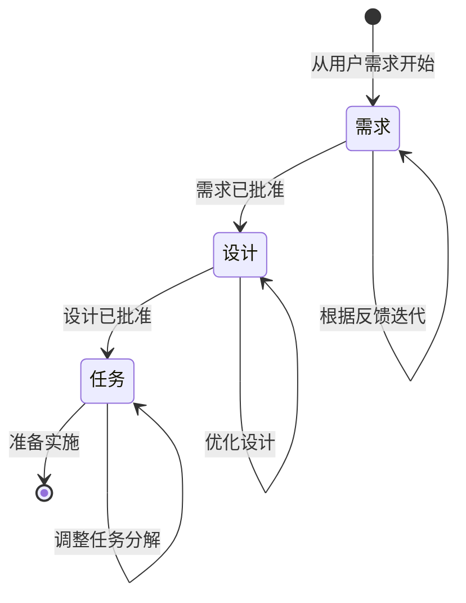

# 流程指南

<!-- 导航元数据 -->
<!-- 章节：流程 | 级别：概述 | 先决条件：methodology/README.md -->
<!-- 相关：templates/README.md, prompting/strategies.md, examples/simple-feature-spec.md -->

**📍 您的位置：** [主指南](../../README.md) → **流程指南**

## 快速导航
- **先决条件：** [方法论概述](../methodology/README.md) - 首先理解基础
- **模板：** [即用型模板](../templates/README.md) - 快速开始
- **示例：** [查看完整规范](../examples/README.md) - 从真实示例中学习
- **AI 辅助：** [提示策略](../prompting/README.md) - 与 AI 有效协作

---

三阶段规范驱动开发工作流的分步演练。

## 本章节内容

- **[需求阶段](requirements-phase.md)** - 使用 EARS 格式收集和构建需求
- **[设计阶段](design-phase.md)** - 创建包含研究的综合设计文档
- **[任务阶段](tasks-phase.md)** - 将设计分解为可操作的编码任务
- **[变更管理](change-management.md)** - 管理规范演进和处理发现的需求
- **[工作流图表](workflow-diagrams.md)** - 可视化流程和决策点

## 三阶段工作流

每个阶段都建立在前一个阶段的基础上，并设有明确的批准门禁，以在继续之前确保质量和一致性。

## 阶段概述

1. **需求** - 将粗略的想法转化为结构化的、可测试的需求
2. **设计** - 研究并构建一个全面的解决方案
3. **任务** - 创建一个包含离散编码步骤的可操作实施计划

---

## 🔗 相关内容

### 先决条件
- [方法论概述](../methodology/README.md) - 首先理解基础

### 下一步
- [需求阶段](requirements-phase.md) - 开始三阶段流程
- [模板](../templates/README.md) - 获取即用型起点

### 相关章节
- [示例](../examples/README.md) - 查看完整的流程示例
- [提示策略](../prompting/README.md) - 获得更好的 AI 协作
- [执行指南](../execution/README.md) - 实施您完成的规范

[← 返回主指南](../../README.md) | [从需求开始 →](requirements-phase.md)