# 工作流图表和视觉辅助

本文档提供了规范驱动开发流程的可视化表示，包括完整的工作流图、决策树和阶段转换流程。

## 完整流程图

下图显示了从初始构想到实施的完整规范驱动开发工作流：

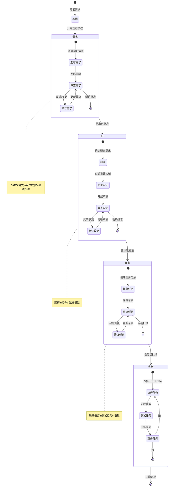

## 阶段转换决策树

此决策树有助于确定何时在阶段之间移动以及何时进行迭代：

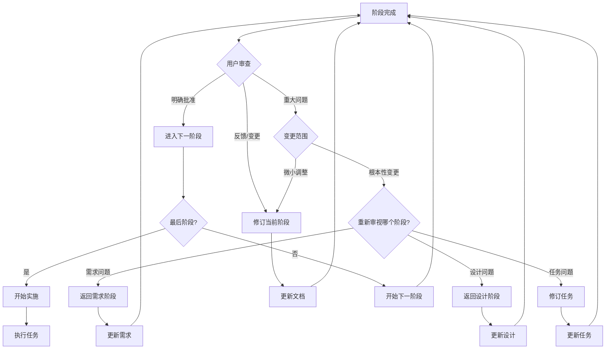

## 需求阶段流程

需求收集阶段的详细工作流：

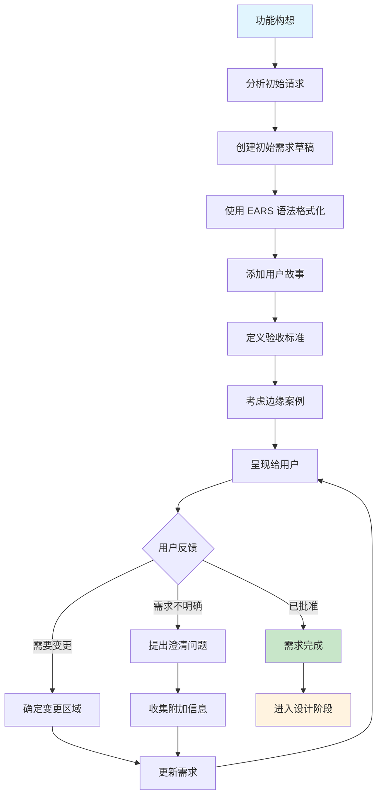

## 设计阶段流程

设计阶段的详细工作流：

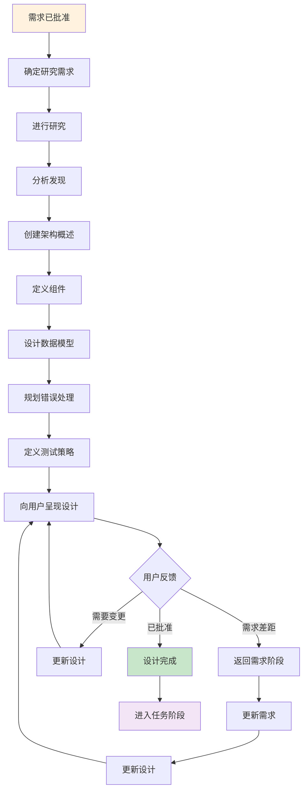

## 任务阶段流程

将设计分解为实施任务的详细工作流：

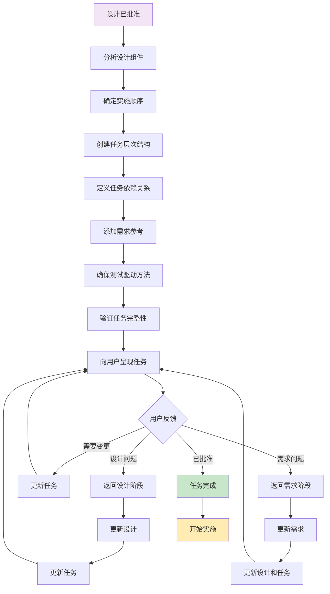

## 实施执行流程

从实施计划中执行单个任务的工作流：

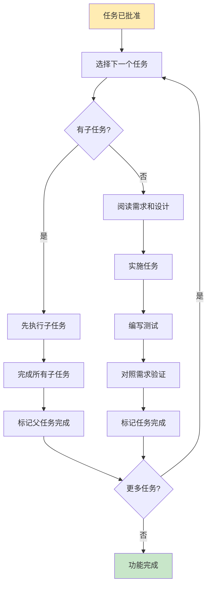

## 反馈循环模式

处理反馈和迭代的常见模式：

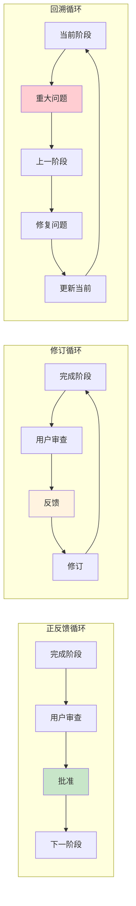

## 入口点和背景

用户可以进入规范工作流的不同方式：

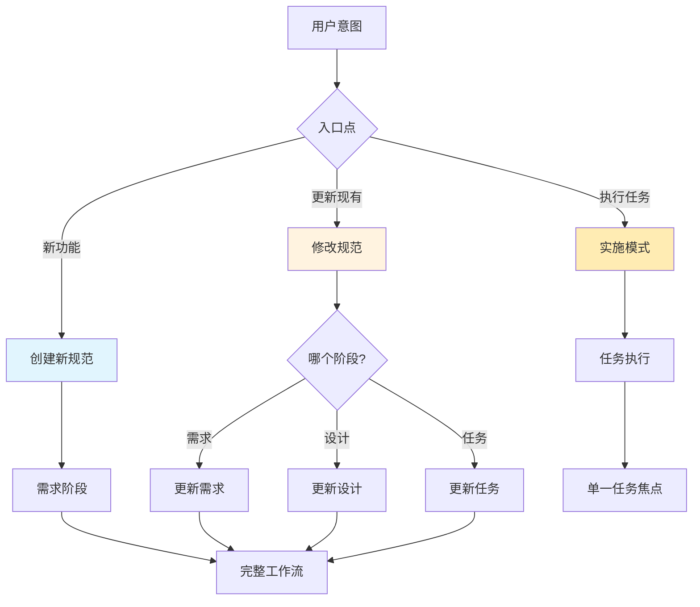

## 质量门禁和验证点

整个过程中的关键验证检查点：

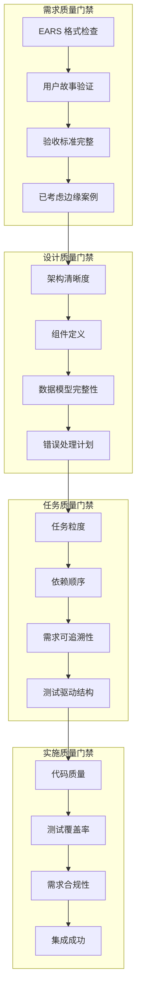

## 常见工作流场景

### 场景1：平滑的线性进展
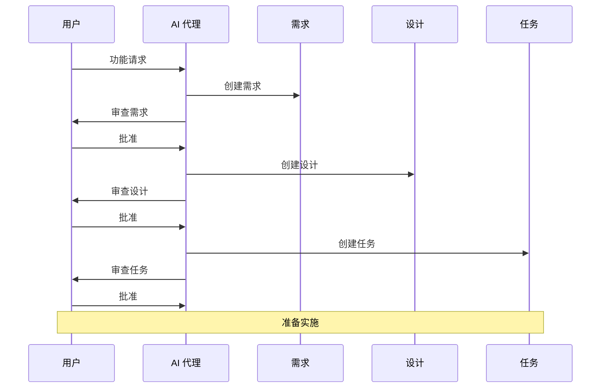

### 场景2：迭代求精
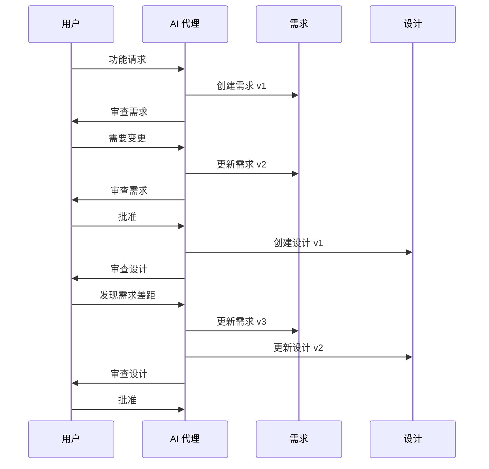

### 场景3：实施反馈
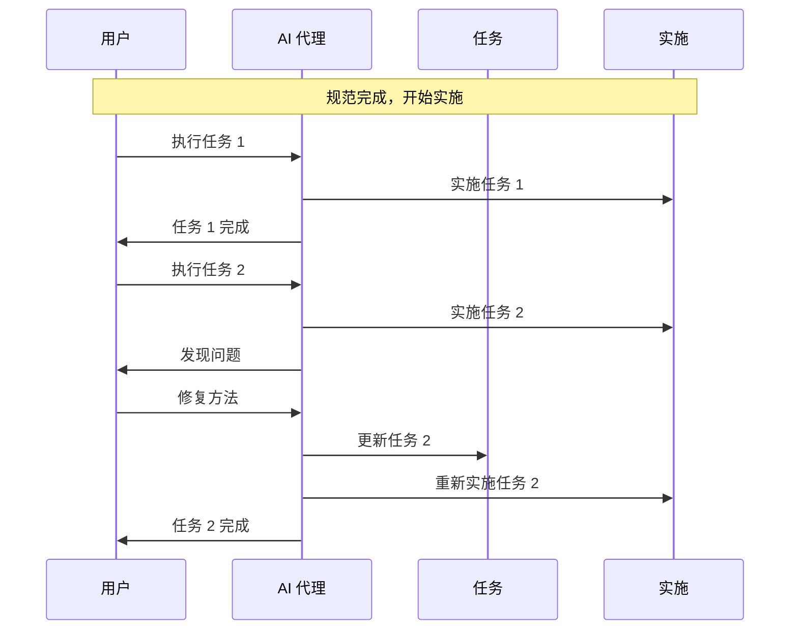

这些视觉辅助工具为理解和导航规范驱动开发流程提供了全面的指导，为学习该方法论的新手和寻求快速参考材料的经验丰富的从业者提供了支持。