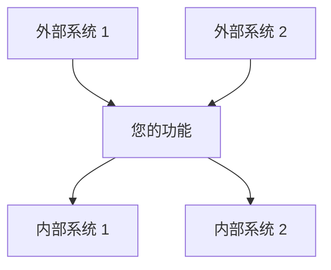
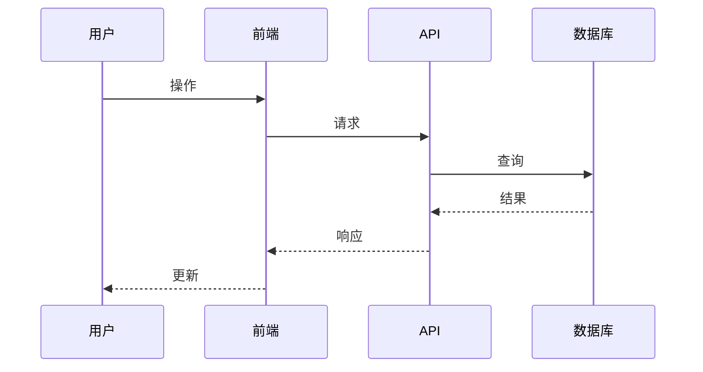
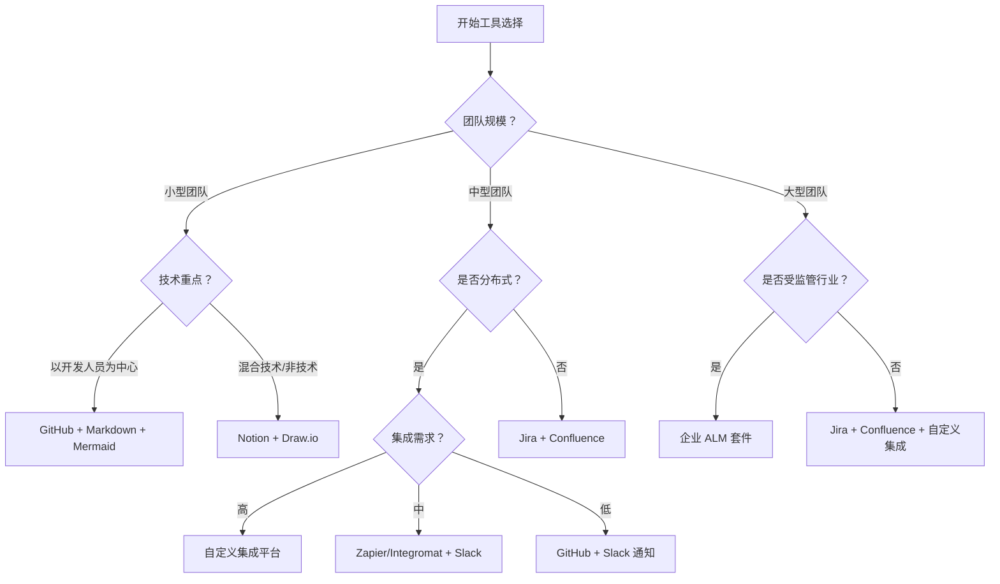

# 规范流程的工具集成指南

本指南提供了将各种工具与规范驱动的开发流程集成的实用说明，重点关注自动化、效率和无缝工作流。

## 将工具与规范流程集成

### 需求阶段集成

#### 文档管理工具

**GitHub/GitLab 集成**
```bash
# 创建规范目录结构
mkdir -p .kiro/specs/my-feature
touch .kiro/specs/my-feature/requirements.md
touch .kiro/specs/my-feature/design.md
touch .kiro/specs/my-feature/tasks.md

# 设置 git 钩子以进行验证
cat > .git/hooks/pre-commit << 'EOF'
#!/bin/bash
files=$(git diff --cached --name-only | grep -E "\.kiro/specs/.*/requirements\.md$")
if [ -n "$files" ]; then
  echo "正在验证需求格式..."
  ./scripts/validate-requirements.sh $files
  if [ $? -ne 0 ]; then
    echo "需求验证失败。请在提交前修复问题。"
    exit 1
  fi
fi
exit 0
EOF
chmod +x .git/hooks/pre-commit
```

**Notion 集成**
```javascript
// 示例：Notion API 集成以同步需求
const { Client } = require('@notionhq/client');
const fs = require('fs');
const path = require('path');

const notion = new Client({ auth: process.env.NOTION_API_KEY });

async function syncRequirementsToNotion(requirementsPath, databaseId) {
  const content = fs.readFileSync(requirementsPath, 'utf8');
  const requirements = parseRequirements(content);
  
  for (const req of requirements) {
    await notion.pages.create({
      parent: { database_id: databaseId },
      properties: {
        Name: { title: [{ text: { content: req.title } }] },
        Status: { select: { name: 'Draft' } },
        'User Story': { rich_text: [{ text: { content: req.userStory } }] },
        'Acceptance Criteria': { rich_text: [{ text: { content: req.criteria.join('\n') } }] }
      }
    });
  }
}
```

#### 需求验证工具

**EARS 验证器脚本**
```python
#!/usr/bin/env python3
# validate-ears.py - 验证需求文档中的 EARS 格式

import re
import sys

def validate_ears(file_path):
    with open(file_path, 'r') as f:
        content = f.read()
    
    # 查找所有验收标准部分
    criteria_sections = re.findall(r'#### Acceptance Criteria\n\n(.*?)(?=\n\n|\Z)', content, re.DOTALL)
    
    errors = []
    for section in criteria_sections:
        criteria = [c.strip() for c in section.split('\n') if c.strip()]
        for i, criterion in enumerate(criteria):
            # 检查 EARS 格式
            if not (re.match(r'^[0-9]+\.\s+WHEN .+ THEN .+ SHALL .+$', criterion) or
                    re.match(r'^[0-9]+\.\s+IF .+ THEN .+ SHALL .+$', criterion) or
                    re.match(r'^[0-9]+\.\s+WHILE .+ .+ SHALL .+$', criterion) or
                    re.match(r'^[0-9]+\.\s+WHERE .+ .+ SHALL .+$', criterion)):
                errors.append(f"无效的 EARS 格式: {criterion}")
    
    if errors:
        print(f"文件 {file_path} 验证失败:")
        for error in errors:
            print(f"  - {error}")
        return False
    
    print(f"文件 {file_path} 验证通过")
    return True

if __name__ == "__main__":
    if len(sys.argv) < 2:
        print("用法: validate-ears.py <requirements_file>")
        sys.exit(1)
    
    success = validate_ears(sys.argv[1])
    sys.exit(0 if success else 1)
```

### 设计阶段集成

#### 图表工具

**Mermaid 集成**
```javascript
// 示例：从设计规范生成 Mermaid 图表
const fs = require('fs');
const path = require('path');

function extractMermaidDiagrams(designPath) {
  const content = fs.readFileSync(designPath, 'utf8');
  const diagrams = [];
  
  // 提取 Mermaid 代码块
  const regex = /```mermaid\n([\s\S]*?)\n```/g;
  let match;
  
  while ((match = regex.exec(content)) !== null) {
    diagrams.push(match[1]);
  }
  
  return diagrams;
}

function generateDiagramImages(designPath, outputDir) {
  const diagrams = extractMermaidDiagrams(designPath);
  
  if (!fs.existsSync(outputDir)) {
    fs.mkdirSync(outputDir, { recursive: true });
  }
  
  diagrams.forEach((diagram, index) => {
    const tempFile = path.join(outputDir, `diagram_${index}.mmd`);
    fs.writeFileSync(tempFile, diagram);
    
    // 使用 mermaid-cli 生成图像
    const outputFile = path.join(outputDir, `diagram_${index}.png`);
    execSync(`mmdc -i ${tempFile} -o ${outputFile}`);
    
    console.log(`已生成图表: ${outputFile}`);
  });
}
```

**Draw.io 集成**
```bash
#!/bin/bash
# sync-diagrams.sh - 将 Draw.io 图表与规范存储库同步

SPEC_DIR=".kiro/specs"
DIAGRAMS_DIR="diagrams"

# 确保图表目录存在
mkdir -p "$DIAGRAMS_DIR"

# 查找所有设计文档
find "$SPEC_DIR" -name "design.md" | while read design_file; do
  feature_name=$(basename $(dirname "$design_file"))
  feature_diagrams_dir="$DIAGRAMS_DIR/$feature_name"
  mkdir -p "$feature_diagrams_dir"
  
  # 提取图表引用
  grep -o "!.*\](.*\.drawio)" "$design_file" | sed -E 's/.*\]\((.*)\)/\1/' | while read diagram_path; do
    # 如果图表存在，则将其复制到中心位置
    if [[ -f "$diagram_path" ]]; then
      cp "$diagram_path" "$feature_diagrams_dir/"
      echo "已同步图表: $diagram_path -> $feature_diagrams_dir/"
    fi
  done
done
```

### 任务阶段集成

#### 项目管理集成

**GitHub Issues 集成**
```javascript
// 示例：从任务文档生成 GitHub issues
const { Octokit } = require('@octokit/rest');
const fs = require('fs');
const path = require('path');

const octokit = new Octokit({ auth: process.env.GITHUB_TOKEN });

async function createIssuesFromTasks(tasksPath, owner, repo) {
  const content = fs.readFileSync(tasksPath, 'utf8');
  const tasks = parseTasks(content);
  
  for (const task of tasks) {
    // 创建 GitHub issue
    await octokit.issues.create({
      owner,
      repo,
      title: task.title,
      body: `${task.details}\n\n**需求:** ${task.requirements}`,
      labels: ['spec-task']
    });
    
    console.log(`已创建 issue: ${task.title}`);
  }
}

function parseTasks(content) {
  const tasks = [];
  const regex = /- \[ \] ([0-9.]+) (.*?)\n((?:  - .*
)*)(  - _Requirements: (.*?)_)/g;
  let match;
  
  while ((match = regex.exec(content)) !== null) {
    const taskNumber = match[1];
    const title = match[2];
    const details = match[3].trim().split('\n').map(line => line.trim().substring(2)).join('\n');
    const requirements = match[5];
    
    tasks.push({
      title: `${taskNumber} ${title}`,
      details,
      requirements
    });
  }
  
  return tasks;
}
```

**Jira 集成**
```python
#!/usr/bin/env python3
# sync-jira.py - 将任务与 Jira 同步

import os
import re
import sys
from jira import JIRA

def parse_tasks(tasks_file):
    with open(tasks_file, 'r') as f:
        content = f.read()
    
    tasks = []
    task_pattern = r'- \[ \] ([0-9.]+) (.*?)\n((?:  - .*
)*)(  - _Requirements: (.*?)_)'
    
    for match in re.finditer(task_pattern, content, re.MULTILINE):
        task_number = match.group(1)
        title = match.group(2)
        details = match.group(3).strip()
        requirements = match.group(5)
        
        tasks.append({
            'key': task_number,
            'title': title,
            'description': details,
            'requirements': requirements
        })
    
    return tasks

def sync_with_jira(tasks, project_key):
    jira = JIRA(
        server=os.environ.get('JIRA_SERVER'),
        basic_auth=(os.environ.get('JIRA_USER'), os.environ.get('JIRA_TOKEN'))
    )
    
    for task in tasks:
        # 检查 issue 是否已存在
        existing_issues = jira.search_issues(f'project={project_key} AND summary~"{task["key"]} {task["title"]}"')
        
        if existing_issues:
            issue = existing_issues[0]
            print(f"正在更新 issue: {issue.key}")
            jira.issue(issue.key).update(
                summary=f"{task['key']} {task['title']}",
                description=f"{task['description']}\n\n需求: {task['requirements']}"
            )
        else:
            print(f"正在创建 issue: {task['key']} {task['title']}")
            jira.create_issue(
                project=project_key,
                summary=f"{task['key']} {task['title']}",
                description=f"{task['description']}\n\n需求: {task['requirements']}",
                issuetype={'name': 'Task'}
            )

if __name__ == "__main__":
    if len(sys.argv) < 3:
        print("用法: sync-jira.py <tasks_file> <jira_project_key>")
        sys.exit(1)
    
    tasks = parse_tasks(sys.argv[1])
    sync_with_jira(tasks, sys.argv[2])
```

### 跨阶段集成

#### CI/CD 集成

**GitHub Actions 工作流**
```yaml
# .github/workflows/spec-validation.yml
name: 规范验证

on:
  push:
    paths:
      - '.kiro/specs/**'
  pull_request:
    paths:
      - '.kiro/specs/**'

jobs:
  validate:
    runs-on: ubuntu-latest
    steps:
      - uses: actions/checkout@v2
      
      - name: 设置 Python
        uses: actions/setup-python@v2
        with:
          python-version: '3.x'
          
      - name: 安装依赖
        run: |
          python -m pip install --upgrade pip
          pip install pyyaml markdown
          
      - name: 验证需求格式
        run: |
          python scripts/validate-requirements.py
          
      - name: 检查需求-设计可追溯性
        run: |
          python scripts/check-traceability.py
          
      - name: 生成规范报告
        run: |
          python scripts/generate-spec-report.py
          
      - name: 上传规范报告
        uses: actions/upload-artifact@v2
        with:
          name: spec-reports
          path: reports/
```

**可追溯性检查器脚本**
```python
#!/usr/bin/env python3
# check-traceability.py - 检查需求和设计之间的可追溯性

import os
import re
import sys
import glob

def extract_requirements(req_file):
    with open(req_file, 'r') as f:
        content = f.read()
    
    req_ids = []
    req_pattern = r'### Requirement ([0-9]+)'
    
    for match in re.finditer(req_pattern, content):
        req_ids.append(match.group(1))
    
    return req_ids

def check_design_coverage(design_file, req_ids):
    with open(design_file, 'r') as f:
        content = f.read()
    
    covered_reqs = set()
    for req_id in req_ids:
        if re.search(r'Requirement ' + re.escape(req_id), content):
            covered_reqs.add(req_id)
    
    return covered_reqs

def check_traceability():
    spec_dirs = glob.glob('.kiro/specs/*/')
    
    for spec_dir in spec_dirs:
        req_file = os.path.join(spec_dir, 'requirements.md')
        design_file = os.path.join(spec_dir, 'design.md')
        
        if not os.path.exists(req_file) or not os.path.exists(design_file):
            continue
        
        feature_name = os.path.basename(os.path.dirname(spec_dir))
        print(f"正在检查 {feature_name} 的可追溯性...")
        
        req_ids = extract_requirements(req_file)
        covered_reqs = check_design_coverage(design_file, req_ids)
        
        missing_reqs = set(req_ids) - covered_reqs
        
        if missing_reqs:
            print(f"  警告：以下需求未在设计中涵盖：")
            for req_id in missing_reqs:
                print(f"    - Requirement {req_id}")
        else:
            print(f"  所有需求都已在设计中涵盖。 সন")

if __name__ == "__main__":
    check_traceability()
```

#### 文档生成

**规范报告生成器**
```python
#!/usr/bin/env python3
# generate-spec-report.py - 从规范文档生成 HTML 报告

import os
import re
import glob
import markdown
import json
from datetime import datetime

def generate_report():
    spec_dirs = glob.glob('.kiro/specs/*/')
    reports_dir = 'reports'
    
    if not os.path.exists(reports_dir):
        os.makedirs(reports_dir)
    
    index_data = []
    
    for spec_dir in spec_dirs:
        feature_name = os.path.basename(os.path.dirname(spec_dir))
        req_file = os.path.join(spec_dir, 'requirements.md')
        design_file = os.path.join(spec_dir, 'design.md')
        tasks_file = os.path.join(spec_dir, 'tasks.md')
        
        if not os.path.exists(req_file):
            continue
        
        # 生成功能报告
        feature_report = {
            'name': feature_name,
            'requirements': os.path.exists(req_file),
            'design': os.path.exists(design_file),
            'tasks': os.path.exists(tasks_file),
            'timestamp': datetime.now().strftime('%Y-%m-%d %H:%M:%S')
        }
        
        # 提取需求
        if os.path.exists(req_file):
            with open(req_file, 'r') as f:
                req_content = f.read()
            
            feature_report['req_count'] = len(re.findall(r'### Requirement', req_content))
            feature_report['req_html'] = markdown.markdown(req_content)
        
        # 提取设计信息
        if os.path.exists(design_file):
            with open(design_file, 'r') as f:
                design_content = f.read()
            
            feature_report['design_html'] = markdown.markdown(design_content)
        
        # 提取任务信息
        if os.path.exists(tasks_file):
            with open(tasks_file, 'r') as f:
                tasks_content = f.read()
            
            feature_report['total_tasks'] = len(re.findall(r'- [ ]', tasks_content))
            feature_report['completed_tasks'] = len(re.findall(r'- [x]', tasks_content))
            feature_report['tasks_html'] = markdown.markdown(tasks_content)
        
        # 生成 HTML 报告
        report_html = generate_html_report(feature_report)
        report_path = os.path.join(reports_dir, f"{feature_name}.html")
        
        with open(report_path, 'w') as f:
            f.write(report_html)
        
        print(f"已生成报告: {report_path}")
        
        # 添加到索引
        index_data.append({
            'name': feature_name,
            'req_count': feature_report.get('req_count', 0),
            'total_tasks': feature_report.get('total_tasks', 0),
            'completed_tasks': feature_report.get('completed_tasks', 0),
            'report_url': f"{feature_name}.html"
        })
    
    # 生成索引页面
    index_html = generate_index_html(index_data)
    index_path = os.path.join(reports_dir, "index.html")
    
    with open(index_path, 'w') as f:
        f.write(index_html)
    
    print(f"已生成索引: {index_path}")

def generate_html_report(feature_report):
    # HTML 模板实现
    html = f'''<!DOCTYPE html>
<html>
<head>
    <title>{feature_report['name']} - 规范报告</title>
    <style>
        body {{ font-family: Arial, sans-serif; margin: 20px; }}
        h1 {{ color: #333; }}
        .section {{ margin-bottom: 30px; }}
        .progress {{ width: 100%; background-color: #e0e0e0; }}
        .progress-bar {{ height: 20px; background-color: #4CAF50; }}
        .stats {{ display: flex; gap: 20px; }}
        .stat-box {{ padding: 10px; border: 1px solid #ddd; border-radius: 5px; }}
    </style>
</head>
<body>
    <h1>{feature_report['name']} - 规范报告</h1>
    <p>生成于 {feature_report['timestamp']}</p>
    
    <div class="stats">
        <div class="stat-box">
            <h3>需求</h3>
            <p>{feature_report.get('req_count', 0)} 个需求</p>
        </div>
        <div class="stat-box">
            <h3>任务</h3>
            <p>{feature_report.get('completed_tasks', 0)} / {feature_report.get('total_tasks', 0)} 已完成</p>
        </div>
    </div>
    
    <div class="section">
        <h2>需求</h2>
        {feature_report.get('req_html', '<p>未找到需求文档。</p>')}
    </div>
    
    <div class="section">
        <h2>设计</h2>
        {feature_report.get('design_html', '<p>未找到设计文档。</p>')}
    </div>
    
    <div class="section">
        <h2>任务</h2>
        {feature_report.get('tasks_html', '<p>未找到任务文档。</p>')}
    </div>
</body>
</html>'''
    return html

def generate_index_html(index_data):
    features_html = ""
    for feature in index_data:
        task_progress = 0
        if feature.get('total_tasks', 0) > 0:
            task_progress = (feature.get('completed_tasks', 0) / feature.get('total_tasks', 0)) * 100
        
        features_html += f'''
        <tr>
            <td><a href="{feature['report_url']}">{feature['name']}</a></td>
            <td>{feature['req_count']}</td>
            <td>{feature['completed_tasks']} / {feature['total_tasks']}</td>
            <td>
                <div class="progress">
                    <div class="progress-bar" style="width: {task_progress}%;"></div>
                </div>
            </td>
        </tr>
        '''
    
    html = f'''<!DOCTYPE html>
<html>
<head>
    <title>规范报告</title>
    <style>
        body {{ font-family: Arial, sans-serif; margin: 20px; }}
        h1 {{ color: #333; }}
        table {{ width: 100%; border-collapse: collapse; }}
        th, td {{ padding: 8px; text-align: left; border-bottom: 1px solid #ddd; }}
        th {{ background-color: #f2f2f2; }}
        .progress {{ width: 100%; background-color: #e0e0e0; }}
        .progress-bar {{ height: 20px; background-color: #4CAF50; }}
    </style>
</head>
<body>
    <h1>规范报告</h1>
    <p>生成于 {datetime.now().strftime('%Y-%m-%d %H:%M:%S')}</p>
    
    <table>
        <tr>
            <th>功能</th>
            <th>需求</th>
            <th>任务</th>
            <th>进度</th>
        </tr>
        {features_html}
    </table>
</body>
</html>'''
    return html

if __name__ == "__main__":
    generate_report()
```

## 工具集成模板

### 需求阶段模板

#### 需求自动化脚本
```bash
#!/bin/bash
# create-requirements.sh - 从模板创建新的需求文档

if [ $# -lt 1 ]; then
  echo "用法: $0 <feature-name>"
  exit 1
fi

FEATURE_NAME=$1
SPEC_DIR=".kiro/specs/$FEATURE_NAME"
REQ_FILE="$SPEC_DIR/requirements.md"

# 如果目录不存在则创建
mkdir -p "$SPEC_DIR"

# 检查需求文件是否已存在
if [ -f "$REQ_FILE" ]; then
  echo "需求文件已存在: $REQ_FILE"
  exit 1
fi

# 从模板创建需求文件
cat > "$REQ_FILE" << 'EOF'
# 需求文档

## 引言

[提供清晰、简洁的功能概述。解释它解决了什么问题以及为什么需要它。]

## 需求

### 需求 1

**用户故事：** 作为一个 [角色]，我想要 [功能]，以便 [好处]。

#### 验收标准

1. WHEN [事件] THEN [系统] SHALL [响应]
2. IF [条件] THEN [系统] SHALL [响应]

### 需求 2

**用户故事：** 作为一个 [角色]，我想要 [功能]，以便 [好处]。

#### 验收标准

1. WHEN [事件] THEN [系统] SHALL [响应]
2. IF [条件] THEN [系统] SHALL [响应]
EOF

echo "已创建需求文件: $REQ_FILE"
```

### 设计阶段模板

#### 设计文档生成器
```python
#!/usr/bin/env python3
# generate-design.py - 从需求生成设计文档

import os
import re
import sys
import datetime

def extract_requirements(req_file):
    with open(req_file, 'r') as f:
        content = f.read()
    
    # 提取引言
    intro_match = re.search(r'## 引言\n\n(.*?)(?=\n\n##)', content, re.DOTALL)
    introduction = intro_match.group(1) if intro_match else ""
    
    # 提取需求
    requirements = []
    req_pattern = r'### 需求 ([0-9]+)\n\n\*\*用户故事：\*\* (.*?)\n\n#### 验收标准\n\n(.*?)(?=\n\n###|\Z)'
    
    for match in re.finditer(req_pattern, content, re.DOTALL):
        req_id = match.group(1)
        user_story = match.group(2)
        criteria = match.group(3)
        
        requirements.append({
            'id': req_id,
            'user_story': user_story,
            'criteria': criteria
        })
    
    return {
        'introduction': introduction,
        'requirements': requirements
    }

def generate_design_doc(feature_name, req_data):
    today = datetime.datetime.now().strftime('%Y-%m-%d')
    
    design = f'''# 设计文档

## 概述

{req_data['introduction']}

### 设计目标
- [主要目标 1]
- [主要目标 2]
- [主要目标 3]

### 关键设计决策
- [决策 1 及理由]
- [决策 2 及理由]
- [决策 3 及理由]

## 架构

### 系统上下文
[描述此功能如何融入更广泛的系统。包括外部依赖和集成点。]



### 高层架构
[描述总体架构方法和主要组件。]


### 技术栈
| 层 | 技术 | 理由 |
|-------|------------|-----------|
| 前端 | [技术] | [为什么选择] |
| 后端 | [技术] | [为什么选择] |
| 数据库 | [技术] | [为什么选择] |
| 基础设施 | [技术] | [为什么选择] |

## 组件和接口

'''

    # 根据需求添加组件
    for i, req in enumerate(req_data['requirements'], 1):
        design += f'''### 组件 {i}: [组件名称]

**目的**: [此组件做什么]

**职责**:
- [职责 1]
- [职责 2]
- [职责 3]

**接口**:
- **输入**: [它接收什么]
- **输出**: [它产生什么]
- **依赖**: [它依赖什么]

**实现说明**:
- [关键实现细节 1]
- [关键实现细节 2]

**解决的需求**:
- 需求 {req['id']}: {req['user_story']}

'''

    # 添加数据模型部分
    design += '''## 数据模型

### 实体 1: [实体名称]

```typescript
interface EntityName {
  id: string;
  property1: string;
  property2: number;
  property3: boolean;
  createdAt: Date;
  updatedAt: Date;
}
```

**验证规则**:
- [验证规则 1]
- [验证规则 2]

**关系**:
- [与其他实体的关系]

### 数据流



## 错误处理

### 错误类别
| 类别 | HTTP 状态 | 描述 | 用户操作 |
|----------|-------------|-------------|-------------|
| 验证 | 400 | 无效的输入数据 | 修复输入并重试 |
| 认证 | 401 | 无效的凭据 | 重新认证 |
| 授权 | 403 | 权限不足 | 联系管理员 |
| 未找到 | 404 | 资源不存在 | 检查资源标识符 |
| 服务器错误 | 500 | 内部系统错误 | 稍后重试或联系支持 |

## 测试策略

### 单元测试
- **覆盖率目标**: [百分比]
- **测试框架**: [框架名称]
- **关键测试领域**: [要测试的关键功能]

### 集成测试
- **API 测试**: [方法和工具]
- **数据库测试**: [方法和工具]
- **外部服务测试**: [模拟策略]

### 端到端测试
- **用户场景**: [要测试的关键用户旅程]
- **测试工具**: [E2E 测试框架]
- **测试环境**: [环境设置]
'''

    return design

def main():
    if len(sys.argv) < 2:
        print("用法: generate-design.py <feature-name>")
        sys.exit(1)
    
    feature_name = sys.argv[1]
    spec_dir = f".kiro/specs/{feature_name}"
    req_file = f"{spec_dir}/requirements.md"
    design_file = f"{spec_dir}/design.md"
    
    if not os.path.exists(req_file):
        print(f"未找到需求文件: {req_file}")
        sys.exit(1)
    
    if os.path.exists(design_file):
        print(f"设计文件已存在: {design_file}")
        response = input("您想覆盖它吗？ (y/n): ")
        if response.lower() != 'y':
            sys.exit(0)
    
    req_data = extract_requirements(req_file)
    design_content = generate_design_doc(feature_name, req_data)
    
    with open(design_file, 'w') as f:
        f.write(design_content)
    
    print(f"已生成设计文档: {design_file}")

if __name__ == "__main__":
    main()
```

### 任务阶段模板

#### 任务生成器脚本
```python
#!/usr/bin/env python3
# generate-tasks.py - 从设计和需求生成任务文档

import os
import re
import sys
import datetime

def extract_components(design_file):
    with open(design_file, 'r') as f:
        content = f.read()
    
    components = []
    component_pattern = r'### 组件 \d+: \[(.*?)\]\n\n\*\*目的\*\*: (.*?)\n\n\*\*职责\*\*:\n(.*?)\n\n\*\*接口\*\*:'
    
    for match in re.finditer(component_pattern, content, re.DOTALL):
        name = match.group(1)
        purpose = match.group(2)
        responsibilities = re.findall(r'- (.*?)$', match.group(3), re.MULTILINE)
        
        components.append({
            'name': name,
            'purpose': purpose,
            'responsibilities': responsibilities
        })
    
    # 提取每个组件解决的需求
    req_pattern = r'\*\*解决的需求\*\*:\n- 需求 (\d+)'
    for i, component in enumerate(components):
        component_text = re.search(f'### 组件 {i+1}.*?(?=### 组件|\Z)', content, re.DOTALL)
        if component_text:
            req_matches = re.findall(req_pattern, component_text.group(0))
            component['requirements'] = req_matches
    
    return components

def generate_tasks_doc(feature_name, components):
    today = datetime.datetime.now().strftime('%Y-%m-%d')
    
    tasks = f'''# 实施计划

## 阶段 1：基础和设置

- [ ] 1. 设置项目结构和开发环境
  - 为功能创建目录结构
  - 设置构建配置和依赖项
  - 配置开发工具和 linting
  - _需求: [参考具体需求]_

'''

    task_num = 2
    
    # 添加组件实施任务
    for i, component in enumerate(components):
        tasks += f'''- [ ] {task_num}. 实施 {component['name']}
'''
        
        # 为每个组件添加子任务
        subtask_num = 1
        
        # 数据模型任务
        tasks += f'''- [ ] {task_num}.{subtask_num} 创建数据模型和接口
  - 为所有数据模型定义 TypeScript 接口
  - 实施数据完整性验证函数
  - 为数据模型验证创建单元测试
  - _需求: {', '.join(component.get('requirements', ['待定']))}_

'''
        subtask_num += 1
        
        # 核心功能任务
        tasks += f'''- [ ] {task_num}.{subtask_num} 实施核心功能
  - 为 {component['name']} 开发主要业务逻辑
  - 处理边缘案例和错误条件
  - 编写全面的单元测试
  - _需求: {', '.join(component.get('requirements', ['待定']))}_

'''
        subtask_num += 1
        
        # 集成任务
        tasks += f'''- [ ] {task_num}.{subtask_num} 与其他组件集成
  - 实施与依赖组件的接口
  - 创建集成测试
  - 记录集成点
  - _需求: {', '.join(component.get('requirements', ['待定']))}_

'''
        
        task_num += 1
    
    # 添加测试和文档任务
    tasks += f'''- [ ] {task_num}. 实施全面测试
- [ ] {task_num}.1 创建单元测试套件
  - 为所有组件实施测试
  - 设置测试自动化
  - 确保足够的代码覆盖率
  - _需求: 全部_

- [ ] {task_num}.2 实施集成测试
  - 测试组件交互
  - 验证端到端工作流
  - 测试错误处理和边缘案例
  - _需求: 全部_

- [ ] {task_num+1}. 创建文档
- [ ] {task_num+1}.1 编写 API 文档
  - 记录所有公共接口
  - 包括用法示例
  - 记录错误响应
  - _需求: 全部_

- [ ] {task_num+1}.2 更新用户文档
  - 记录新功能
  - 创建用户指南
  - 更新相关的现有文档
  - _需求: 全部_
'''
    
    return tasks

def main():
    if len(sys.argv) < 2:
        print("用法: generate-tasks.py <feature-name>")
        sys.exit(1)
    
    feature_name = sys.argv[1]
    spec_dir = f".kiro/specs/{feature_name}"
    design_file = f"{spec_dir}/design.md"
    tasks_file = f"{spec_dir}/tasks.md"
    
    if not os.path.exists(design_file):
        print(f"未找到设计文件: {design_file}")
        sys.exit(1)
    
    if os.path.exists(tasks_file):
        print(f"任务文件已存在: {tasks_file}")
        response = input("您想覆盖它吗？ (y/n): ")
        if response.lower() != 'y':
            sys.exit(0)
    
    components = extract_components(design_file)
    tasks_content = generate_tasks_doc(feature_name, components)
    
    with open(tasks_file, 'w') as f:
        f.write(tasks_content)
    
    print(f"已生成任务文档: {tasks_file}")

if __name__ == "__main__":
    main()
```

## 自动化工作流

### 完整的规范创建工作流

```bash
#!/bin/bash
# create-spec.sh - 从头创建完整的规范

if [ $# -lt 1 ]; then
  echo "用法: $0 <feature-name>"
  exit 1
fi

FEATURE_NAME=$1
SPEC_DIR=".kiro/specs/$FEATURE_NAME"

# 创建目录结构
mkdir -p "$SPEC_DIR"

# 创建需求模板
echo "正在创建需求文档..."
./scripts/create-requirements.sh "$FEATURE_NAME"

echo ""
echo "需求文档已创建于 $SPEC_DIR/requirements.md"
echo "请编辑需求文档，然后运行："
echo "  ./scripts/generate-design.py $FEATURE_NAME"
echo "以根据您的需求生成设计文档。"
```

### 规范审查工作流

```bash
#!/bin/bash
# review-spec.sh - 运行验证并生成审查报告

if [ $# -lt 1 ]; then
  echo "用法: $0 <feature-name>"
  exit 1
fi

FEATURE_NAME=$1
SPEC_DIR=".kiro/specs/$FEATURE_NAME"
REPORT_DIR="reports/$FEATURE_NAME"

# 创建报告目录
mkdir -p "$REPORT_DIR"

# 验证需求
echo "正在验证需求..."
python scripts/validate-requirements.py "$SPEC_DIR/requirements.md" > "$REPORT_DIR/requirements-validation.txt"

# 检查可追溯性
echo "正在检查可追溯性..."
python scripts/check-traceability.py "$FEATURE_NAME" > "$REPORT_DIR/traceability-report.txt"

# 生成审查清单
echo "正在生成审查清单..."
python scripts/generate-checklists.py "$FEATURE_NAME" "$REPORT_DIR"

# 生成 HTML 报告
echo "正在生成 HTML 报告..."
python scripts/generate-spec-report.py "$FEATURE_NAME" "$REPORT_DIR"

echo ""
echo "审查报告已生成在 $REPORT_DIR"
echo "打开 $REPORT_DIR/index.html 查看完整报告。"
```

## 集成最佳实践

### 版本控制集成

1.  **分支策略**
    *   为每个规范使用功能分支：`feature/spec-{feature-name}`
    *   为每个阶段创建单独的分支：`feature/spec-{feature-name}-requirements`
    *   使用拉取请求进行审查和批准

2.  **提交消息格式**
    ```
    [SPEC-{feature}] {phase}: {description}
    
    - 详细更改
    - 对需求/设计元素的引用
    ```

3.  **Git 钩子**
    *   使用 pre-commit 钩子进行验证
    *   使用 post-commit 钩子进行通知
    *   使用 pre-push 钩子进行全面检查

### 持续集成

1.  **自动化验证**
    *   在每次提交时运行验证脚本
    *   生成审查报告
    *   如果验证失败则阻止合并

2.  **审查自动化**
    *   自动生成审查清单
    *   在项目管理工具中跟踪审查状态
    *   通知利益相关者待处理的审查

3.  **文档生成**
    *   从规范文件生成文档
    *   保持文档与代码同步
    *   将文档发布到可访问的位置

## 工具选择指南

在为您的规范流程选择工具时，请考虑以下因素：

### 需求阶段工具

| 工具类型 | 推荐用于 | 避免用于 |
|-----------|----------------|-----------|
| Markdown 编辑器 | 版本控制的规范，以开发人员为中心的团队 | 非技术利益相关者，复杂的批准工作流 |
| 需求管理工具 | 受监管的行业，复杂的可追溯性需求 | 小型团队，简单的功能 |
| 协作平台 | 跨职能团队，远程协作 | 安全敏感的项目，离线工作 |

### 设计阶段工具

| 工具类型 | 推荐用于 | 避免用于 |
|-----------|----------------|-----------|
| 图表工具 | 可视化架构，组件关系 | 文本繁重的设计，简单的功能 |
| 建模工具 | 复杂的数据模型，状态机 | 快速原型，简单的功能 |
| 设计系统 | 以 UI 为中心的功能，一致的界面 | 后端服务，基础设施功能 |

### 任务阶段工具

| 工具类型 | 推荐用于 | 避免用于 |
|-----------|----------------|-----------|
| 项目管理 | 任务跟踪，分配，进度监控 | 简单的功能，小型团队 |
| 问题跟踪器 | 错误跟踪，功能请求 | 复杂的依赖关系，资源规划 |
| 看板 | 可视化工作流，状态跟踪 | 详细的报告，复杂的层次结构 |

## 工具集成决策树



---

[← 工具参考](tools.md) | [清单 →](../templates/checklists.md) | [返回资源](README.md)

```