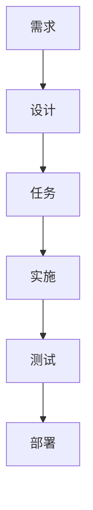

# 工具和集成指南

本指南为支持规范驱动开发过程的工具、平台和集成提供建议。

## 文档工具

### Markdown 编辑器和平台

#### GitHub/GitLab
**最适用于**：版本控制的文档、团队协作

**功能**：
- 原生 Markdown 渲染
- 文档的拉取请求审查
- 问题跟踪集成
- Wiki 功能
- Mermaid 图表支持

**集成技巧**：
- 将规范存储在 `.kiro/specs/` 目录结构中
- 使用分支保护进行规范审查
- 将问题链接到特定需求
- 使用 GitHub Pages 发布文档

#### Notion
**最适用于**：富文本格式、数据库集成、团队维基

**功能**：
- 支持 Markdown 导出的富文本编辑
- 用于需求跟踪的数据库视图
- 用于保持格式一致的模板系统
- 实时协作
- 与项目管理工具集成

**集成技巧**：
- 为每个规范阶段创建模板页面
- 使用数据库跟踪需求状态
- 链接相关页面以进行交叉引用
- 导出为 Markdown 进行版本控制

#### Obsidian
**最适用于**：知识图谱、交叉引用、个人知识管理

**功能**：
- 文档之间的双向链接
- 用于需求关系的图谱视图
- 用于扩展功能的插件生态系统
- 具有同步选项的本地文件存储
- 高级搜索和筛选

**集成技巧**：
- 使用标签进行需求分类
- 创建模板以保持结构一致
- 利用图谱视图进行依赖分析
- 使用每日笔记记录规范开发进度

#### Confluence
**最适用于**：企业文档、结构化内容管理

**功能**：
- 企业级协作
- 高级权限和工作流
- 模板系统和宏
- 与 Atlassian 套件集成
- 高级搜索和报告

**集成技巧**：
- 为规范项目创建空间模板
- 使用页面模板保持格式一致
- 利用宏实现动态内容
- 与 Jira 集成以进行需求跟踪

### 图表工具

#### Mermaid
**最适用于**：基于代码的图表、版本控制集成

**支持的图表**：
- 用于流程图的流程图
- 用于交互的序列图
- 用于数据模型的类图
- 用于系统行为的状态图
- 用于项目时间线的甘特图

**示例用法**：


**集成技巧**：
- 直接嵌入 Markdown 文档
- 在图表中使用一致的样式
- 对图表源代码进行版本控制
- 从图表生成文档

#### Lucidchart
**最适用于**：复杂的系统图、协作设计

**功能**：
- 专业的图表工具
- 实时协作
- 模板库
- 与文档平台集成
- 高级样式和格式

**集成技巧**：
- 为常见模式创建图表模板
- 使用共享文件夹进行团队访问
- 导出图表以嵌入文档
- 将图表链接到特定需求

#### Draw.io (现为 diagrams.net)
**最适用于**：免费图表绘制、离线功能

**功能**：
- 免费和开源
- 基于 Web 和桌面版本
- 与云存储集成
- 广泛的形状库
- 导出为多种格式

**集成技巧**：
- 将图表保存在项目存储库中
- 使用一致的命名约定
- 创建自定义形状库
- 导出为 SVG 以进行可伸缩嵌入

## 项目管理和跟踪

### Linear
**最适用于**：现代项目管理、以开发人员为中心的工作流

**功能**：
- 简洁、快速的界面
- Git 集成
- 自动化工作流
- 需求跟踪
- 冲刺规划

**规范集成**：
- 从需求创建问题
- 将任务链接到特定的验收标准
- 跟踪实施进度
- 生成规范完成情况报告

**设置技巧**：
- 为规范阶段创建标签（需求、设计、任务）
- 使用自定义字段进行需求可追溯性
- 设置状态更新的自动化
- 为不同利益相关者创建视图

### Jira
**最适用于**：企业项目管理、复杂工作流

**功能**：
- 可定制的工作流
- 高级报告
- 集成生态系统
- 需求管理
- 敏捷规划工具

**规范集成**：
- 为每个主要需求创建史诗
- 将史诗分解为用户故事
- 将故事链接到验收标准
- 通过自定义仪表板跟踪进度

**设置技巧**：
- 为需求创建自定义问题类型
- 使用组件按功能区域进行组织
- 设置自定义字段以进行 EARS 跟踪
- 创建规范进度仪表板

### GitHub Issues/Projects
**最适用于**：与代码集成的项目管理、开源项目

**功能**：
- 原生 Git 集成
- 项目板和自动化
- 问题模板
- 里程碑跟踪
- 拉取请求集成

**规范集成**：
- 为需求创建问题模板
- 使用项目板进行规范阶段管理
- 将拉取请求链接到需求
- 通过里程碑跟踪完成情况

**设置技巧**：
- 为需求类型创建标签
- 使用问题模板保持一致性
- 设置项目自动化规则
- 将问题链接到特定的代码更改

### Trello
**最适用于**：简单的看板、可视化项目管理

**功能**：
- 可视化看板
- 基于卡片的组织
- 用于扩展功能的 Power-Up
- 团队协作
- 移动应用

**规范集成**：
- 为每个规范阶段创建看板
- 使用卡片表示单个需求
- 为验收标准添加清单
- 在工作流阶段之间移动卡片

**设置技巧**：
- 为新规范创建看板模板
- 使用标签表示需求优先级
- 为里程碑跟踪添加截止日期
- 使用 Power-Up 进行时间跟踪

## 需求管理工具

### Azure DevOps
**最适用于**：企业需求管理、微软生态系统

**功能**：
- 工作项跟踪
- 需求层次结构
- 可追溯性矩阵
- 测试用例管理
- 与开发工具集成

**规范集成**：
- 为需求创建工作项类型
- 构建需求层次结构
- 将需求链接到测试用例
- 生成可追溯性报告

### IBM DOORS
**最适用于**：受监管行业、复杂的需求可追溯性

**功能**：
- 正式的需求管理
- 变更影响分析
- 基线管理
- 合规性报告
- 与测试工具集成

**规范集成**：
- 从规范导入需求
- 维护需求基线
- 跟踪需求变更
- 生成合规性报告

### Aha!
**最适用于**：产品管理、路线图规划

**功能**：
- 产品路线图管理
- 功能优先级排序
- 利益相关者沟通
- 与开发工具集成
- 战略规划

**规范集成**：
- 从需求创建功能
- 根据业务价值确定优先级
- 向利益相关者传达路线图
- 跟踪功能交付

## 测试和质量保证工具

### 测试管理

#### TestRail
**最适用于**：全面的测试管理、需求可追溯性

**功能**：
- 测试用例管理
- 测试执行跟踪
- 需求覆盖率分析
- 报告和分析
- 与错误跟踪集成

**规范集成**：
- 从验收标准创建测试用例
- 跟踪需求覆盖率
- 将测试结果链接到需求
- 生成覆盖率报告

#### Zephyr
**最适用于**：Jira 集成、敏捷测试

**功能**：
- 原生 Jira 集成
- 测试用例创建和执行
- 实时报告
- 可追溯性矩阵
- 自动化集成

**规范集成**：
- 将测试用例链接到需求问题
- 在 Jira 中跟踪测试进度
- 生成需求覆盖率报告
- 与 CI/CD 管道集成

### 自动化测试

#### Jest/Vitest
**最适用于**：JavaScript/TypeScript 单元测试

**集成技巧**：
- 测试文件名与需求匹配
- 使用 describe 块进行需求分组
- 在测试描述中包含需求 ID
- 生成需求覆盖率报告

#### Cypress/Playwright
**最适用于**：端到端测试、用户场景验证

**集成技巧**：
- 从用户故事创建测试场景
- 使用数据属性进行需求可追溯性
- 生成带有需求映射的测试报告
- 与 CI/CD 集成以进行持续验证

#### Postman/Insomnia
**最适用于**：API 测试、集成验证

**集成技巧**：
- 为 API 需求创建测试集合
- 为不同测试场景使用环境变量
- 从测试生成 API 文档
- 与 CI/CD 集成以进行自动化 API 测试

## 开发和代码质量工具

### 代码质量

#### SonarQube
**最适用于**：代码质量分析、技术债务管理

**功能**：
- 静态代码分析
- 安全漏洞检测
- 代码覆盖率跟踪
- 技术债务评估
- 质量门禁强制执行

**规范集成**：
- 根据需求设置质量门禁
- 跟踪需求实现的代码覆盖率
- 监控技术债务的引入
- 为利益相关者生成质量报告

#### ESLint/Prettier
**最适用于**：代码格式化和 linting

**集成技巧**：
- 根据项目标准配置规则
- 与 CI/CD 集成以进行自动化检查
- 使用 pre-commit 钩子保持一致性
- 生成代码质量指标报告

### 版本控制

#### Git 工作流
**最适用于**：代码版本控制、协作

**规范集成策略**：
- **功能分支**：为每个需求创建分支
- **提交消息**：在提交中引用需求 ID
- **拉取请求**：将 PR 链接到特定需求
- **标签**：用需求完成情况标记发布

**分支命名约定**：
- `feature/req-1.1-user-authentication`
- `bugfix/req-2.3-validation-error`
- `docs/req-update-api-spec`

## CI/CD 和自动化工具

### 持续集成

#### GitHub Actions
**最适用于**：与 GitHub 集成的 CI/CD、工作流自动化

**规范集成**：
- 在与需求相关的更改上触发构建
- 运行特定需求区域的测试
- 生成需求完成情况报告
- 根据需求状态自动部署

**示例工作流**：
```yaml
name: 需求验证
on:
  pull_request:
    paths:
      - 'src/requirements/**'
jobs:
  validate:
    runs-on: ubuntu-latest
    steps:
      - uses: actions/checkout@v2
      - name: 运行需求测试
        run: npm test -- --grep "Requirement"
```

#### Jenkins
**最适用于**：企业 CI/CD、复杂管道

**规范集成**：
- 创建需求验证管道
- 与测试工具集成
- 生成需求完成情况报告
- 根据质量门禁自动部署

#### GitLab CI
**最适用于**：与 GitLab 集成的 CI/CD、DevOps 工作流

**规范集成**：
- 使用合并请求模板进行需求审查
- 创建需求测试管道
- 生成覆盖率报告
- 自动更新需求状态

## 沟通和协作工具

### 团队沟通

#### Slack
**最适用于**：实时团队沟通、集成中心

**规范集成**：
- 创建用于规范讨论的频道
- 使用机器人进行需求状态更新
- 与项目管理工具集成
- 分享规范进度和更新

**机器人集成**：
- 用于规范更改的 GitHub/GitLab 通知
- 用于需求进度的 Jira/Linear 更新
- 用于规范审查的日历提醒
- 用于需求查询的自定义机器人

#### Microsoft Teams
**最适用于**：企业沟通、微软生态系统

**规范集成**：
- 创建用于规范开发的团队
- 为不同规范阶段使用频道
- 与 Azure DevOps 集成
- 共享文档并协作处理规范

#### Discord
**最适用于**：社区驱动的项目、非正式沟通

**规范集成**：
- 创建用于规范讨论的频道
- 使用机器人进行自动化更新
- 分享进度并获取反馈
- 协调开发活动

### 审查和批准

#### ReviewBoard
**最适用于**：代码和文档审查工作流

**功能**：
- 文档审查工作流
- 评论和批准跟踪
- 与版本控制集成
- 审查分析和报告

**规范集成**：
- 审查需求文档
- 跟踪批准状态
- 管理审查反馈
- 生成审查报告

#### Collaborator
**最适用于**：企业代码和文档审查

**功能**：
- 正式的审查流程
- 合规性报告
- 与开发工具集成
- 高级分析

**规范集成**：
- 正式的规范审查流程
- 合规性跟踪
- 审查指标和报告
- 与质量门禁集成

## 监控和分析工具

### 应用监控

#### DataDog
**最适用于**：应用性能监控、可观察性

**规范集成**：
- 监控特定需求的指标
- 创建功能性能仪表板
- 设置需求违规警报
- 跟踪用户行为以进行需求验证

#### New Relic
**最适用于**：应用性能监控、用户体验

**规范集成**：
- 监控功能性能指标
- 跟踪用户与新功能的交互
- 设置性能需求警报
- 生成需求合规性报告

### 分析和报告

#### Google Analytics
**最适用于**：用户行为跟踪、功能使用分析

**规范集成**：
- 跟踪新功能的使用情况
- 衡量需求成功指标
- 分析用户行为模式
- 生成功能采用率报告

#### Mixpanel
**最适用于**：产品分析、事件跟踪

**规范集成**：
- 跟踪特定需求的事件
- 衡量功能成功指标
- 分析用户参与度
- 生成需求性能报告

## 工具集成策略

### 工作流集成

#### 单一事实来源
- 选择一个主要工具进行需求存储
- 使用 API 在工具之间同步数据
- 保持跨平台的一致性
- 建立明确的数据所有权

#### API 集成
- 使用 webhook 进行实时更新
- 在需要时实施自定义集成
- 利用现有的集成平台
- 监控集成健康状况和性能

#### 自动化工作流
- 自动更新工具之间的状态
- 为需求更改创建触发器
- 自动生成报告
- 通知利益相关者重要更新

### 最佳实践

#### 工具选择标准
- **团队规模**：选择能与您的团队一起扩展的工具
- **预算**：考虑您组织的成本与价值
- **集成**：确保工具之间能很好地协同工作
- **学习曲线**：考虑采用时间和培训需求
- **支持**：评估供应商支持和社区

#### 实施策略
1.  **从小处着手**：从核心工具开始，逐步扩展
2.  **试点项目**：首先与小团队一起测试工具
3.  **培训**：为团队成员提供充分的培训
4.  **反馈**：收集反馈并迭代工具使用情况
5.  **优化**：持续优化工作流和集成

#### 维护和更新
- 定期审查工具的有效性
- 保持集成更新和安全
- 监控工具使用和采用情况
- 规划工具迁移和升级
- 维护工具使用文档

---

## 工具比较矩阵

| 类别 | 工具 | 最适用于 | 成本 | 学习曲线 | 集成 |
|----------|------|----------|------|----------------|-------------|
| 文档 | GitHub | 版本控制 | 免费/付费 | 低 | 优秀 |
| 文档 | Notion | 富文本格式 | 付费 | 中 | 良好 |
| 文档 | Confluence | 企业 | 付费 | 中 | 优秀 |
| 项目管理 | Linear | 现代团队 | 付费 | 低 | 良好 |
| 项目管理 | Jira | 企业 | 付费 | 高 | 优秀 |
| 项目管理 | GitHub Projects | 代码集成 | 免费/付费 | 低 | 优秀 |
| 图表 | Mermaid | 基于代码 | 免费 | 中 | 优秀 |
| 图表 | Lucidchart | 专业 | 付费 | 低 | 良好 |
| 测试 | Jest | 单元测试 | 免费 | 中 | 良好 |
| 测试 | Cypress | E2E 测试 | 免费/付费 | 中 | 良好 |
| CI/CD | GitHub Actions | GitHub 集成 | 免费/付费 | 中 | 优秀 |
| CI/CD | Jenkins | 企业 | 免费 | 高 | 良好 |

## 推荐的工具栈

### 创业/小型团队栈
**预算**：低到中  
**团队规模**：2-10 名开发人员  
**复杂性**：低到中

**核心工具**：
- **文档**：GitHub + Markdown
- **项目管理**：Linear 或 GitHub Projects
- **图表**：Mermaid (嵌入文档中)
- **测试**：Jest + Cypress
- **CI/CD**：GitHub Actions
- **沟通**：Slack

**总成本**：每月 50-200 美元  
**设置时间**：1-2 天  
**学习曲线**：低

**优点**：
- 集成的生态系统
- 低成本和复杂性
- 快速设置和采用
- 适合以代码为中心的团队

**缺点**：
- 有限的高级功能
- 可能无法扩展到大型团队
- 企业集成较少

### 企业栈
**预算**：高  
**团队规模**：50+ 名开发人员  
**复杂性**：高

**核心工具**：
- **文档**：Confluence + SharePoint
- **项目管理**：Jira + Azure DevOps
- **需求**：IBM DOORS 或 Azure DevOps
- **图表**：Lucidchart + Visio
- **测试**：TestRail + Selenium Grid
- **CI/CD**：Jenkins + Azure Pipelines
- **沟通**：Microsoft Teams

**总成本**：每月 500-2000 美元  
**设置时间**：2-4 周  
**学习曲线**：高

**优点**：
- 企业级功能
- 高级报告和分析
- 合规性和审计支持
- 广泛的集成选项

**缺点**：
- 高成本和复杂性
- 更长的设置和培训时间
- 对于较小的项目可能过于庞大

### 混合/现代栈
**预算**：中  
**团队规模**：10-50 名开发人员  
**复杂性**：中

**核心工具**：
- **文档**：Notion + GitHub
- **项目管理**：Linear + Jira (用于复杂项目)
- **图表**：Mermaid + Lucidchart
- **测试**：Jest + Playwright + TestRail
- **CI/CD**：GitHub Actions + Jenkins
- **沟通**：Slack + Microsoft Teams

**总成本**：每月 200-800 美元  
**设置时间**：1 周  
**学习曲线**：中

**优点**：
- 功能和成本的平衡
- 灵活且适应性强
- 良好的集成选项
- 随团队增长而扩展

**缺点**：
- 需要更多的工具管理
- 潜在的集成复杂性
- 可能需要自定义解决方案

## 工具选择框架

### 评估标准

#### 功能需求
1.  **核心功能**：工具是否提供基本功能？
2.  **集成**：它与现有工具的集成情况如何？
3.  **可伸缩性**：它能否与您的团队和项目一起成长？
4.  **定制化**：它能否适应您的特定需求？
5.  **报告**：它是否提供必要的分析和报告？

#### 非功能需求
1.  **性能**：工具是否快速且响应灵敏？
2.  **可靠性**：它是否稳定并在需要时可用？
3.  **安全性**：它是否满足您的安全要求？
4.  **可用性**：它是否易于学习和使用？
5.  **支持**：提供何种级别的支持？

#### 业务考虑
1.  **成本**：总拥有成本，包括许可证、培训、维护
2.  **投资回报率**：预期的投资回报和生产力提升
3.  **风险**：供应商稳定性、锁定问题、迁移复杂性
4.  **合规性**：法规和政策合规性要求
5.  **时间表**：实施时间表和资源要求

### 决策矩阵模板

| 工具 | 核心功能 | 集成 | 可伸缩性 | 成本 | 可用性 | 总分 |
|------|---------------|-------------|-------------|------|-----------|-------------|
| 选项 1 | 8/10 | 7/10 | 9/10 | 6/10 | 8/10 | 38/50 |
| 选项 2 | 9/10 | 8/10 | 7/10 | 8/10 | 7/10 | 39/50 |
| 选项 3 | 7/10 | 9/10 | 8/10 | 7/10 | 9/10 | 40/50 |

### 实施路线图

#### 阶段 1：基础 (第 1-2 周)
- 设置核心文档平台
- 配置基本项目管理
- 建立团队沟通渠道
- 创建初始模板和工作流

#### 阶段 2：增强 (第 3-4 周)
- 添加图表和可视化工具
- 实施测试和质量保证工具
- 设置基本自动化和 CI/CD
- 对团队进行新工具和流程的培训

#### 阶段 3：优化 (第 5-8 周)
- 集成高级功能和定制
- 实施全面的监控和报告
- 优化工作流和自动化
- 收集反馈并迭代流程

#### 阶段 4：扩展 (持续)
- 根据需要添加其他工具
- 为大型团队扩展流程
- 实施高级集成
- 持续改进和优化

## 集成模式和最佳实践

### API 集成模式

#### 基于 Webhook 的集成
```javascript
// 示例：GitHub webhook 更新项目管理工具
app.post('/webhook/github', (req, res) => {
  const { action, pull_request } = req.body;
  
  if (action === 'opened' && pull_request.title.includes('[REQ-')) {
    // 从 PR 标题中提取需求 ID
    const reqId = pull_request.title.match(/\[REQ-(\d+\.\d+)\]/)[1];
    
    // 更新项目管理工具
    await updateTaskStatus(reqId, 'in_progress');
  }
  
  res.status(200).send('OK');
});
```

#### 基于轮询的集成
```javascript
// 示例：在工具之间同步需求状态
async function syncRequirementStatus() {
  const requirements = await getRequirementsFromSource();
  
  for (const req of requirements) {
    const currentStatus = await getStatusFromProjectTool(req.id);
    const expectedStatus = await getStatusFromRequirementTool(req.id);
    
    if (currentStatus !== expectedStatus) {
      await updateStatus(req.id, expectedStatus);
    }
  }
}

// 每 15 分钟运行一次
setInterval(syncRequirementStatus, 15 * 60 * 1000);
```

#### 事件驱动的集成
```javascript
// 示例：用于工具集成的事件总线
class SpecEventBus {
  constructor() {
    this.subscribers = new Map();
  }
  
  subscribe(event, handler) {
    if (!this.subscribers.has(event)) {
      this.subscribers.set(event, []);
    }
    this.subscribers.get(event).push(handler);
  }
  
  publish(event, data) {
    const handlers = this.subscribers.get(event) || [];
    handlers.forEach(handler => handler(data));
  }
}

// 用法
const eventBus = new SpecEventBus();

eventBus.subscribe('requirement.updated', async (data) => {
  await updateProjectManagementTool(data);
  await notifyStakeholders(data);
  await updateDocumentation(data);
});
```

### 数据同步策略

#### 主从模式
- 一个工具作为事实的主来源
- 其他工具从主来源同步
- 易于实施和维护
- 如果主来源失败，则存在数据丢失的风险

#### 多主模式
- 多个工具可以更新相同的数据
- 需要冲突解决机制
- 更复杂但更具弹性
- 更适合分布式团队

#### 事件溯源模式
- 所有更改都作为事件存储
- 工具重播事件以构建当前状态
- 出色的审计跟踪和调试
- 实施更复杂

### 自动化工作流

#### 需求生命周期自动化
```yaml
# 用于需求更新的 GitHub Actions 工作流
name: 需求生命周期
on:
  push:
    paths:
      - '.kiro/specs/*/requirements.md'

jobs:
  validate-requirements:
    runs-on: ubuntu-latest
    steps:
      - uses: actions/checkout@v2
      - name: 验证 EARS 格式
        run: |
          python scripts/validate_ears.py
      - name: 更新项目管理
        run: |
          python scripts/sync_requirements.py
      - name: 通知利益相关者
        run: |
          python scripts/notify_stakeholders.py
```

#### 测试集成自动化
```yaml
# 基于需求的自动化测试
name: 需求测试
on:
  pull_request:
    types: [opened, synchronize]

jobs:
  test-requirements:
    runs-on: ubuntu-latest
    steps:
      - uses: actions/checkout@v2
      - name: 提取需求 ID
        id: extract
        run: |
          echo "::set-output name=req_ids::$(grep -o 'REQ-[0-9]\+\.[0-9]\+' ${{ github.event.pull_request.body }})"
      - name: 运行特定需求的测试
        run: |
          npm test -- --grep "${{ steps.extract.outputs.req_ids }}"
```

## 安全和合规性考虑

### 数据保护
- **加密**：确保数据在传输和静态时都已加密
- **访问控制**：实施基于角色的访问控制
- **审计日志**：维护全面的审计日志
- **数据保留**：实施适当的数据保留策略

### 合规性要求
- **GDPR**：确保工具符合数据保护法规
- **SOX**：维护财务合规性的审计跟踪
- **HIPAA**：如果适用，保护健康信息
- **行业标准**：遵循相关的行业标准

### 安全最佳实践
- **认证**：使用强认证机制
- **授权**：实施最小权限访问
- **网络安全**：保护网络通信
- **漏洞管理**：定期进行安全评估

## 成本优化策略

### 许可证管理
- **基于用户的许可**：优化用户分配
- **基于功能的许可**：只为需要的功能付费
- **批量折扣**：为大型团队协商更优惠的价格
- **年度与月度**：考虑年度承诺以节省费用

### 资源优化
- **云与本地**：评估总拥有成本
- **共享资源**：在多个项目之间共享工具
- **自动化**：通过自动化减少手动工作
- **培训**：投资培训以提高效率

### 投资回报率衡量
- **生产力指标**：衡量开发速度的提高
- **质量指标**：跟踪缺陷减少和质量改进
- **时间节省**：量化通过自动化节省的时间
- **成本规避**：计算通过更好的流程避免的成本

---

[← 标准](standards.md) | [清单 →](../templates/checklists.md) | [返回资源](README.md)
