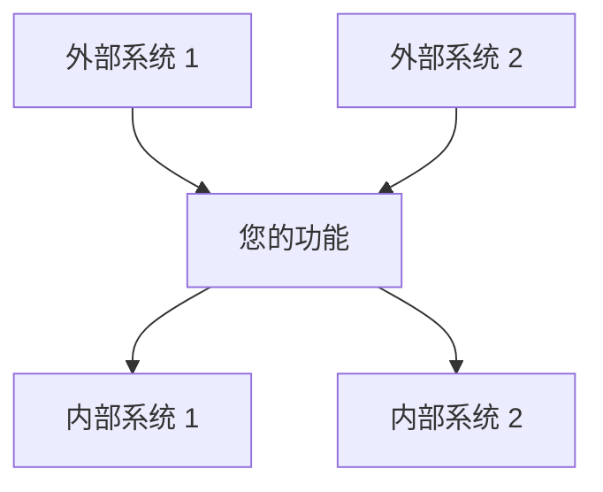
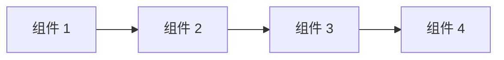
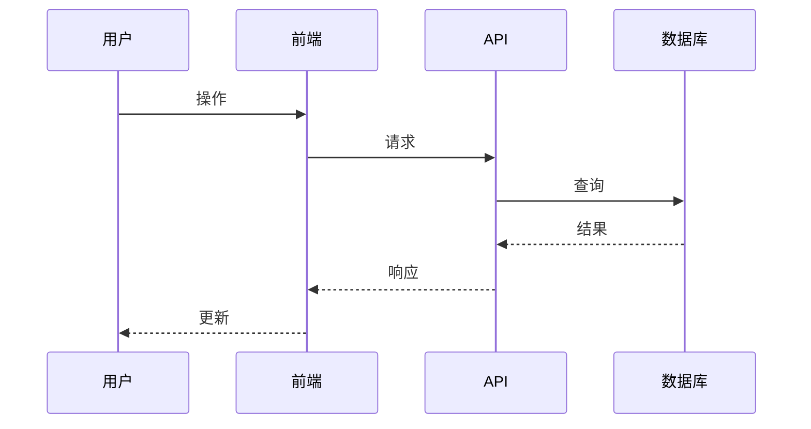

# 设计模板

<!-- 导航元数据 -->
<!-- 模板：设计 | 级别：模板 | 先决条件：requirements-template.md -->
<!-- 相关：process/design-phase.md, ai-reasoning/decision-frameworks.md, examples/complex-system-spec.md -->

**📍 您的位置：** [主指南](../../README.md) → [模板](README.md) → **设计模板**

## 快速导航
- **📚 学习流程：** [设计阶段指南](../process/design-phase.md) - 如何使用此模板
- **📖 查看示例：** [复杂系统设计](../examples/complex-system-spec.md#design-document) - 模板实际应用
- **🧠 决策辅助：** [决策框架](../ai-reasoning/decision-frameworks.md) - 如何做出设计选择
- **➡️ 下一模板：** [任务模板](tasks-template.md) - 设计完成后

---

使用此模板创建全面的设计文档，将需求转化为技术规范。

## 文档信息

- **功能名称**：[您的功能名称]
- **版本**：1.0
- **日期**：[当前日期]
- **作者**：[您的姓名]
- **审查者**：[列出技术审查者]
- **相关文档**：[链接到需求文档]

## 概述

[提供设计方法的高级摘要。解释此设计如何满足需求并融入整体系统架构。保持本节简洁但全面。]

### 设计目标
- [主要目标 1]
- [主要目标 2]
- [主要目标 3]

### 关键设计决策
- [决策 1 及理由]
- [决策 2 及理由]
- [决策 3 及理由]

## 架构

### 系统上下文
[描述此功能如何融入更广泛的系统。包括外部依赖和集成点。]



### 高层架构
[描述总体架构方法和主要组件。]



### 技术栈
| 层 | 技术 | 理由 |
|-------|------------|-----------|
| 前端 | [技术] | [为什么选择] |
| 后端 | [技术] | [为什么选择] |
| 数据库 | [技术] | [为什么选择] |
| 基础设施 | [技术] | [为什么选择] |

## 组件和接口

### 组件 1：[组件名称]

**目的**：[此组件做什么]

**职责**：
- [职责 1]
- [职责 2]
- [职责 3]

**接口**：
- **输入**：[它接收什么]
- **输出**：[它产生什么]
- **依赖**：[它依赖什么]

**实施说明**：
- [关键实施细节 1]
- [关键实施细节 2]

### 组件 2：[组件名称]

**目的**：[此组件做什么]

**职责**：
- [职责 1]
- [职责 2]

**接口**：
- **输入**：[它接收什么]
- **输出**：[它产生什么]
- **依赖**：[它依赖什么]

**实施说明**：
- [关键实施细节 1]
- [关键实施细节 2]

### 组件 3：[组件名称]

**目的**：[此组件做什么]

**职责**：
- [职责 1]
- [职责 2]

**接口**：
- **输入**：[它接收什么]
- **输出**：[它产生什么]
- **依赖**：[它依赖什么]

**实施说明**：
- [关键实施细节 1]
- [关键实施细节 2]

## 数据模型

### 实体 1：[实体名称]

```typescript
interface 实体名称 {
  id: string;
  property1: string;
  property2: number;
  property3: boolean;
  createdAt: Date;
  updatedAt: Date;
}
```

**验证规则**：
- [验证规则 1]
- [验证规则 2]

**关系**：
- [与其他实体的关系]

### 实体 2：[实体名称]

```typescript
interface 实体名称 {
  id: string;
  property1: string;
  property2: 实体名称[];
  status: 'active' | 'inactive' | 'pending';
}
```

**验证规则**：
- [验证规则 1]
- [验证规则 2]

**关系**：
- [与其他实体的关系]

### 数据流



## API 设计

### 端点 1：[端点名称]

**方法**：`POST`  
**路径**：`/api/v1/[资源]`

**请求**：
```json
{
  "property1": "string",
  "property2": "number",
  "property3": "boolean"
}
```

**响应**：
```json
{
  "id": "string",
  "property1": "string",
  "property2": "number",
  "createdAt": "ISO 日期字符串"
}
```

**错误响应**：
- `400 Bad Request`：[发生情况]
- `401 Unauthorized`：[发生情况]
- `404 Not Found`：[发生情况]

### 端点 2：[端点名称]

**方法**：`GET`  
**路径**：`/api/v1/[资源]/{id}`

**参数**：
- `id` (路径)：[描述]
- `include` (查询，可选)：[描述]

**响应**：
```json
{
  "id": "string",
  "property1": "string",
  "property2": "number"
}
```

## 安全考虑

### 认证
- [认证方法和实施]
- [令牌管理方法]

### 授权
- [授权模型和规则]
- [权限检查策略]

### 数据保护
- [数据加密方法]
- [个人身份信息处理程序]
- [数据保留策略]

### 输入验证
- [验证策略]
- [清理程序]
- [速率限制方法]

## 错误处理

### 错误类别
| 类别 | HTTP 状态 | 描述 | 用户操作 |
|----------|-------------|-------------|-------------|
| 验证 | 400 | 无效的输入数据 | 修复输入并重试 |
| 认证 | 401 | 无效的凭据 | 重新认证 |
| 授权 | 403 | 权限不足 | 联系管理员 |
| 未找到 | 404 | 资源不存在 | 检查资源标识符 |
| 服务器错误 | 500 | 内部系统错误 | 稍后重试或联系支持 |

### 错误响应格式
```json
{
  "error": {
    "code": "错误代码",
    "message": "人类可读的错误消息",
    "details": {
      "field": "特定字段错误"
    },
    "timestamp": "ISO 日期字符串",
    "requestId": "唯一的请求 ID"
  }
}
```

### 日志策略
- **错误日志**：[记录错误的内容]
- **审计日志**：[记录审计的内容]
- **性能日志**：[记录监控的内容]

## 性能考虑

### 预期负载
- **并发用户**：[数量]
- **每秒请求数**：[数量]
- **数据量**：[大小/增长率]

### 性能要求
- **响应时间**：[目标响应时间]
- **吞吐量**：[目标吞吐量]
- **可用性**：[正常运行时间要求]

### 优化策略
- [缓存策略]
- [数据库优化方法]
- [CDN 使用]
- [负载均衡方法]

### 监控和指标
- [关键性能指标]
- [监控工具和仪表板]
- [警报阈值]

## 测试策略

### 单元测试
- **覆盖率目标**：[百分比]
- **测试框架**：[框架名称]
- **关键测试领域**：[要测试的关键功能]

### 集成测试
- **API 测试**：[方法和工具]
- **数据库测试**：[方法和工具]
- **外部服务测试**：[模拟策略]

### 端到端测试
- **用户场景**：[要测试的关键用户旅程]
- **测试工具**：[端到端测试框架]
- **测试环境**：[环境设置]

### 性能测试
- **负载测试**：[方法和工具]
- **压力测试**：[要测试的限制]
- **监控**：[要跟踪的性能指标]

## 部署和运营

### 部署策略
- [部署方法（蓝绿、滚动等）]
- [环境进展]
- [回滚程序]

### 配置管理
- [配置方法]
- [特定于环境的设置]
- [密钥管理]

### 监控和警报
- [健康检查]
- [要监控的关键指标]
- [警报条件和升级]

### 维护程序
- [定期维护任务]
- [备份和恢复程序]
- [更新和修补策略]

## 迁移和兼容性

### 数据迁移
- [适用的迁移策略]
- [数据转换要求]
- [回滚程序]

### 向后兼容性
- [API 版本控制策略]
- [重大变更程序]
- [弃用时间表]

### 集成影响
- [对现有系统的影响]
- [对依赖系统所需的更改]
- [变更的沟通计划]

---

## 设计审查清单

使用此清单验证您的设计文档：

### 架构
- [ ] 清晰描述了高层架构
- [ ] 定义了组件职责
- [ ] 指定了组件之间的接口
- [ ] 技术选择有合理的理由

### 需求对齐
- [ ] 设计解决了所有功能性需求
- [ ] 考虑了非功能性需求
- [ ] 此设计可以满足成功标准
- [ ] 解决了约束和假设

### 技术质量
- [ ] 设计遵循既定的模式和原则
- [ ] 解决了安全考虑
- [ ] 考虑了性能要求
- [ ] 错误处理是全面的

### 实施准备情况
- [ ] 设计为实施提供了足够的细节
- [ ] 数据模型完整并经过验证
- [ ] API 规范详细
- [ ] 测试策略全面

### 可维护性
- [ ] 设计支持未来的可扩展性
- [ ] 组件松散耦合
- [ ] 配置已外部化
- [ ] 包括了监控和可观察性

---

## 设计模式参考

### 常见考虑模式

**创建型模式**：
- 工厂：当您需要创建对象而不指定确切的类时
- 构建器：当逐步构建复杂对象时
- 单例：当您需要一个类的确切一个实例时

**结构型模式**：
- 适配器：当集成不兼容的接口时
- 装饰器：当在不改变结构的情况下添加行为时
- 外观：当简化复杂的子系统接口时

**行为型模式**：
- 观察者：当对象需要被通知状态变化时
- 策略：当您需要在算法之间切换时
- 命令：当您需要用操作参数化对象时

**架构模式**：
- MVC/MVP/MVVM：用于将表示与业务逻辑分离
- 存储库：用于抽象数据访问逻辑
- 工作单元：用于在多个操作之间保持一致性

---

[← 需求模板](requirements-template.md) | [任务模板 →](tasks-template.md)
